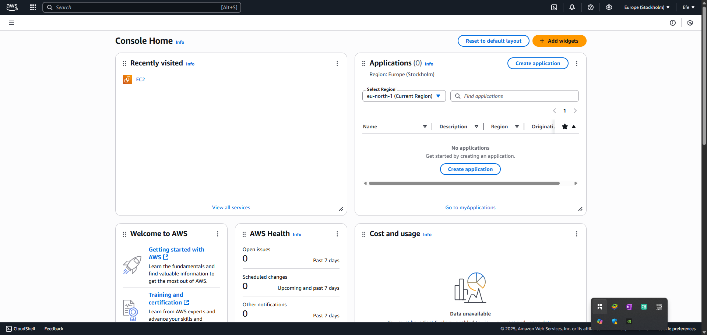

# Tech Environment Setup

## Introduction

This comprehensive installation guide is meticulously crafterd to equip students enrolled in the DevOps program at Darey.io with the necessary tools and environment to successfully complete the course. The project provides detailed instructions for Intalling essential software tools such as Git, Visual Studio Code(VSCode), Terraform, Docker, and Kubernetes, etc, alongside neccessary accounts creations and sunscriptions such as AWS and GitHub. Each section is carefully linked to oddicial sources for downloads and account setups, ensuring both ease of access security.

## Project Prerequisites

- Completion of Tech Environment Setup course
- **Internet connection:** Required for accessing cloud services and downloading software, and documentations
- **Linux/Windows/MacOS Computer:** Adequate performance to run virtual machines and containers (minimum 8GB RAM is recommended). 64-bit architecture is highly recommended

## Tools needed to be installed

1. Visual Studio Code (VSCode)
2. Git
3. VirtualBox
4. Ubuntu on Virtual Box (on windows)
5. Ubuntu on WSL (on macos)

Since i am using a window machine, i will be using Ubuntu partitioning

## Accounts needed to be created

1. GitHub account
2. AWS account

## Installing the tools

Following the video of the tech environment setup course, i will be installing the tools

## Visual Studio Code (VSCode)

Visual Studio Code is a source code editor developed by Microsoft for Windows, Linux and macOS. It includes support for debugging, embedded Git control, syntax highlighting, intelligent code completion, snippets, and code refactoring. It is available for free under the open source MIT license. It can integrate with other tools and services, such as GitHub, GitLab, and Bitbucket, and can be used for a wide range of programming languages, including Python, JavaScript, and TypeScript. It has a vast extension marketplace, allowing users to add new features and functionality to the editor. It is also available as a web application, making it accessible from any device with a web browser.

1. windows Installation

- **Download vscode:** Go to [Visual Studio Code](https://code.visualstudio.com/) and download the latest version of vscode for windows


- **Run the installer:** Run the downloaded installer and follow the on-screen instructions to install vscode


- **Run the installer:** Run the downloaded installer and follow the on-screen instructions to install vscode

- **Verify Installation:** Open vscode and verify that it is installed correctly by checking the version number in the bottom left corner of the window

If your installation was successful, you should it should have the following looks below:


2. MacOS Installation

- **Download vscode:** Go to [Visual Studio Code](https://code.visualstudio.com/) and download the latest version of vscode for macos
  

- **Run the installer:** Run the downloaded installer and follow the on-screen instructions to install vscode

- **Verify Installation:** Open vscode and verify that it is installed correctly by checking the version number in the bottom left corner of the window

If your installation was successful, you should it should have the following looks below:


## Git

1. windows Installation

- **Download git:** Go to [Git](https://git-scm.com/) and download the latest version of git for windows


- On the webpage, click on the "Download" button to download the latest version of git for windows


- **Run the installer:** Run the downloaded installer and follow the on-screen instructions to install git


- **Options to Check durring installation:**

  - "Use Git from the Windows Command Prompt"
  - "Use the OpenSSL library"
  - "Checkout as-is to preserve history"
  - "Use MinTTY (default) for terminal"
  - "Use Windows default console windows"

- **Finish Installation:** Click on "Finish" to complete the installation


- **Launch git bash:** Launch git bash and verify that it is installed correctly by checking the version number in the bottom left corner of the window


If Your installation is successful, it will have the following look after looks. It might be slightly different based on your system but doesn't really matter.

2. MacOS Installation using Homebrew

Since we are not running a mac OS, i will not go into graphical details for the mach related installations

- **Install Homebrew:** Open the Terminal and run the following command to install Homebrew:

```bash
/bin/bash -c "$(curl -fsSL https://raw.githubusercontent.com/Homebrew/install/HEAD/install.sh)"
```

**Note:** If hombrew is already installed, please ignore the above step.

- **Git Installation:** In your terminal type the following command and press enter:

- **Launch git bash:** Launch git bash and verify that it is installed correctly by checking the version number in the bottom left corner of the window

If your installation is succesful, it will have the following look after launching:

**Note:** Other methods to install git on macOs can be found [here](https://git-scm.com/download/mac)

## VirtualBox

1. Windows Installation

- **Download VirtualBox:** Go to [VirtualBox](https://www.virtualbox.org/) and download the latest version of VirtualBox for windows


- On the webpage, click on the "Download" button to download the latest version of VirtualBox for windows

- **Run the installer:** Run the downloaded installer and follow the on-screen instructions to install VirtualBox


- **Wizard:** Follow the wizard to complete the installation

- **Install virtualbox:** Install virtualbox by following the on-screen instructions

- **Launch VirtualBox:** Launch VirtualBox and verify that it is installed correctly by checking the version number in the bottom left corner of the window

If the installation is successfull you will see something like this:


2. MacOS Installation

- **Download VirtualBox:** Go to [VirtualBox](https://www.virtualbox.org/) and download the latest version of VirtualBox for macos

- **Run the installer:** Run the downloaded installer and follow the on-screen instructions to install VirtualBox

- **Wizard:** Follow the wizard to complete the installation

- **Install virtualbox:** Install virtualbox by following the on-screen instructions

- **Launch VirtualBox:** Launch VirtualBox and verify that it is installed correctly by checking the version number in the bottom left corner of the window

If the installation is successfull you will see something like this:


## Ubuntu on VirtualBox

1. Windows Installation

- **Download Ubuntu:** Go to [Ubuntu](https://ubuntu.com/download/desktop) and download the latest version of Ubuntu image


- **Open the Virtual Machine:** Open the viretual machine and select new. select the

- **Run the installer:** Run the downloaded installer and follow the on-screen instructions to install Ubuntu


- **Wizard:** Follow the wizard to complete the installation

- **Install Ubuntu:** Install Ubuntu by following the on-screen instructions

- **Launch Ubuntu:** Launch Ubuntu and verify that it is installed correctly by checking the version number in the bottom left corner of the window

If the installation is successfull you will see something like this:


2. MacOS Installation

- **Download Ubuntu:** Go to [Ubuntu](https://ubuntu.com/download/desktop) and download the latest version of Ubuntu for macos

- **Run the installer:** Run the downloaded installer and follow the on-screen instructions to install Ubuntu

- **Wizard:** Follow the wizard to complete the installation

- **Install Ubuntu:** Install Ubuntu by following the on-screen instructions

- **Launch Ubuntu:** Launch Ubuntu and verify that it is installed correctly by checking the version number in the bottom left corner of the window

If the installation is successfull you will see something like this:

# Creating GitHub and AWS accounts

Please note that accounts creation has nothing to do with the type of OS that you use, since you are dealing with third party services.

## GitHub

- **Visit the GitHub website:** Go to [GitHub](https://github.com) and create an account

- **Create an account:** Go to [GitHub](https://github.com) and create an account


- **Enter your credentials:** Enter your credentials to create an account


- **Verify your account:** Verify your account by checking your email for a verification email

- **Complete the Captcha:** Complete the Captcha to verify that you are not a robot

- **Choose a plan:** Choose a plan that suits your needs. Github offers a free plan which is more than enough for this course

-**Tailor your experinces (Optional):** Tailor your experinces (Optional) by selecting the features that you want to use

- **Welcome to GitHub:** Once you've completed the above steps, you should be redirected to your new GitHub account.

- **Explore GitHub:** Take some time to explore teh Github platform. Familiarize yourself with the different features of the platform and how to use them. YOur new account should look like this:


## AWS

- **Visit the AWS website:** Go to [AWS](https://aws.amazon.com) and create an account

- **Create an account:** Go to [AWS](https://aws.amazon.com) and create an account


- **Enter your credentials:** Enter your credentials to create an account

- **Verify your account:** Verify your account by checking your email for a verification email


- **Complete the Captcha:** Complete the Captcha to verify that you are not a robot

- **Choose a plan:** Choose a plan that suits your needs. AWS offers a free plan which is more than enough for this course

-**Tailor your experinces (Optional):** Tailor your experinces (Optional) by selecting the features that you want to use

- **Welcome to AWS:** Once you've completed the above steps, you should be redirected to your new AWS account.



- **Explore AWS:** Take some time to explore teh AWS platform. Familiarize yourself with the different features of the platform and how to use them.

## Additional Resources

- [AWS Documentation](https://docs.aws.amazon.com/)
- [GitHub Documentation](https://docs.github.com/)
- [VirtualBox Documentation](https://www.virtualbox.org/wiki/Documentation)
- [Ubuntu Documentation](https://ubuntu.com/)
