# Mini Project. Basic Git Command

This is a mini project aimed at understanding documentations and mastering the process incvolved.

## Part 1: Setup and initial configuration

### 1. Install Git:

- Visit the [official Git website](#) and [download](#) the version of git for your operating system. Follow the installation intructions

### 2. Create a GitHub Repository

- sign up or log into [GitHub](#).
- click the "+" icon in the top-right coner and select the "New Repository."

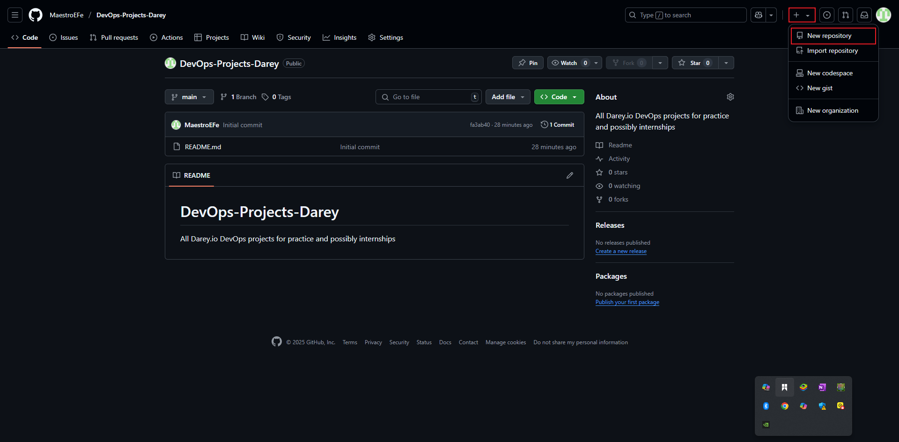

- Name your repository (e.g., "DevOps-Project-Darey") and initialize it with a README file
- Click "Create repository"

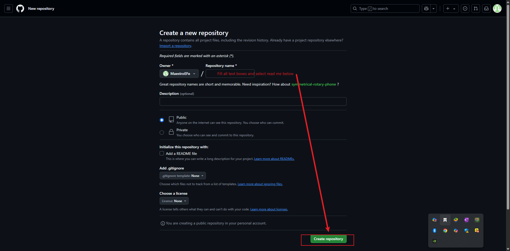

### 3. Clone the Repository

- On your repository's page on GitHub, click the "Code" button and copy the HTTPS URL.

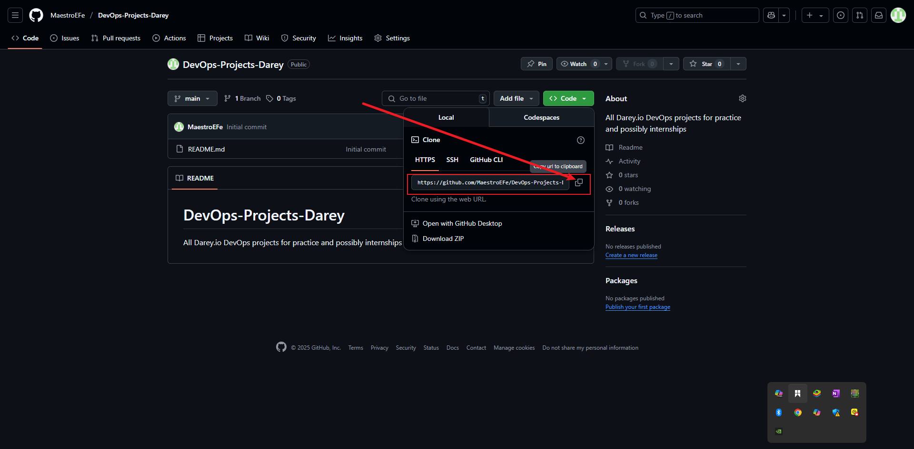

- Open your terminal or command promt
- Create a foler named _"DevOps"_ in the folder where you are storeing all _DAREY.IO and DevOps work_ related work. For example in the Desktop or Documents folder of your laptop, you may create a folder called _"darey-training"_.
- change directory into _"git-project"_

`cd DevOps-Projects-Darey`

- Clone (Download) the repository from GitHub using

`git clone [Past the URL copied from GitHub]
`

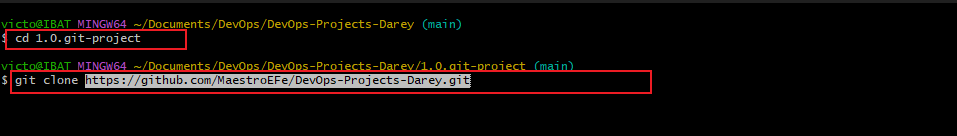

- SInce you just cloned your repository, your brancgh is `main`.
- Navigate into the repostory you just cloned

`cd DevOps-projects-Darey`

- if you are like me, create a new folder for this first project and tag it 1.0.git-project

`cd 1.0.git-project`

- Create an image folder and a new ReadMe.md file for documentation.

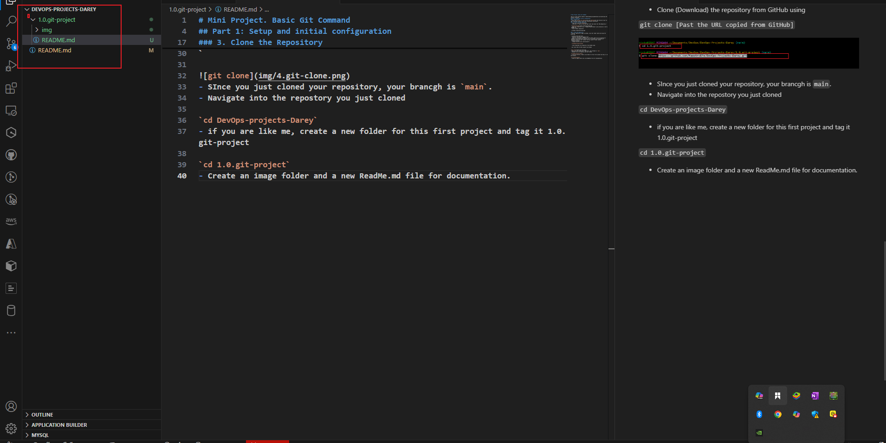

- create an empty file _"index.html"_
- Add the content below
- Check the changes has not been staged

`git status`

- For first commit, stage all changes'

`git add .`

- Confirm changes has been staged with git statu

`git status`

comvirm that after staggin, befor commit, the file names appear in green. This color change signifies that the file has been successfully staged, making it ready for the next step, which is committing these changes to the project history. Note the git add . is not used in the image as the git extension of vs code was used to stage. Git add all change will cause the same effect.

- Commit Changes

```bash
git commit -m "This is my first commit" #where  -m is the commit message
```
This takes the staged changes and reoccords them into the repository's history with a massage descriping what was done. THis commit is a milestone, making a specific point in the project developement.

- Push main brancg to GitHub:

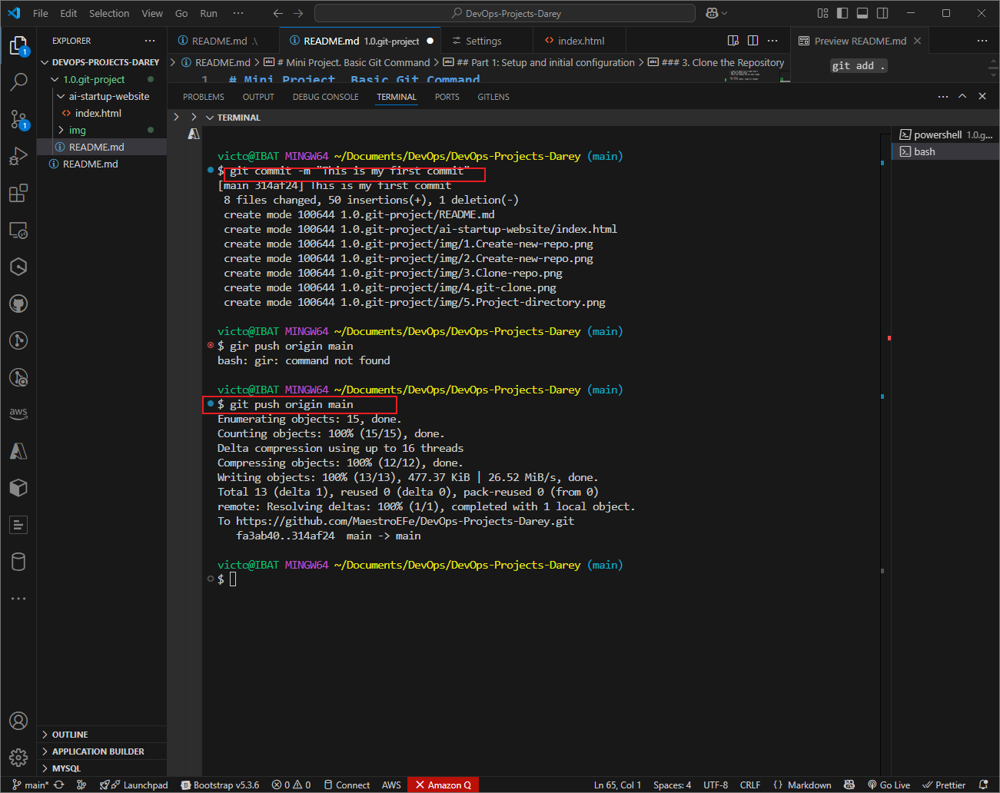

`git push origin main`
This sends commit from your main bnranch on your laptop to GitHubn (Remote Repository)
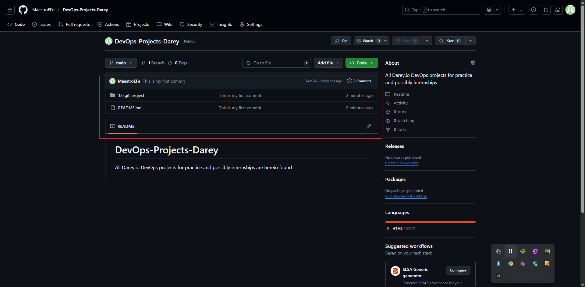

## Part 2

To simulate both Tom and Jerry working on the same laptop, you'll switch between two branches, making changes as each character.

### 1. Tom's Work:

  - Navigate to the project directory you just cloned:
    `cd DevOps-Projects-Darey`.
    This moves you into the folder containing the clones GitHub repository on Tom's local machine. It's like stepping into the project's workspace.
  - Cehck the current branch: This shows you a list of all branches in your local respository. Initially, you will see only the _"main"_ branch because that's the default starting point and no other breanchs have been created yet.

    `git branch`.

  - Create a new branch for Tom's work:

    `git checkout -b update-navigation`.

    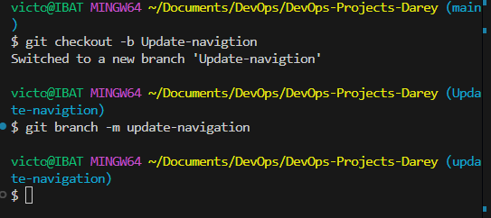

    This creates a new branch named _"update-navigation"_ (you may name it whatever your want). The command also automatically switches to the newly created branch from the _"main"_ branch. This branch _"update-navigation"_ is where you'll simulate Tom's updates to the website without affecting whatever is in the _"main"_ branch.
  - Check the branch again to see your newly created branch.

    `git branch`

    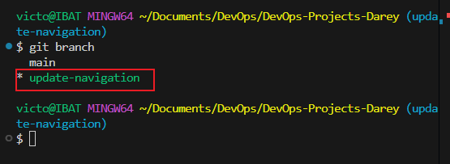

    Runining _git branch_ again now shows your newly created branch, indicating you're now working in this new _"workspace"_ dedicated to Tom's navigation updates.
  - Racall you created an empty file _"index.html"_ in the main. The file will also exist in the `update-navigation-branch`: Open the `index.html` and add the content below.
  - Add the content below

  `This is Tom adding Navigation to the AI-website`

  This simulates Toms Contribution to the project. This text reoresents the text he is doing on the navigation bar. In the real world, this will be an actual software code.

  - Check changes has not been staged

  `git status`
  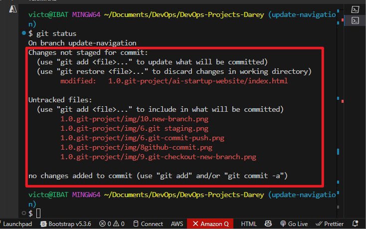

  At this stage, Tom has modified the file, but these changes haven't been prepared for a commit in Git. This is indicated by the file name appearing in _red_ in the terminal output, signalin that the changes are recognized by Git buyt not yet stagged.

  - Stage Tome Changes:
    `git add index.html` => Used if I was in the same directory
    `git add .` to stage all changes while working on the project

  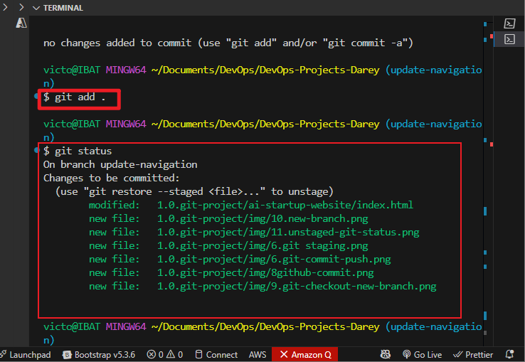

  Now, after staging the changes, the file name will appear in green in the terminal output. This color change signifies that the file has been successfully staged, making it ready for the next step, which is committing these changes to the project's history.

  - Commit Tom's Changes

  `git commit -m "update navigation bar"`

  This takes the staged changes and recoreds them in the repository's history with a message describing what was done. This commit is a milestone, making a special point in the project's developement. Of course.

  <span style ="color: red;">Note that the images added to the img file to be used for the read me documentation too is part of this commit, beyond the scope of this project. </span>

  - Push Tom's brancg to GitHub:

  `git push origin updatge-navigation`
  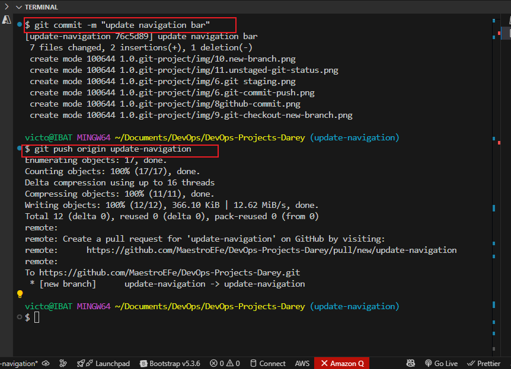
  This sends Tom's commits from your local branch on your laptop to GitHub (remote repository). It's like publishing your work so tht others (ir ub this case, "Jerry") can see and interact with it. This setup updates the repository with Tom's Contributions.

  After completing Tom's workflow, you will now simulate Jerry's contribution to the promect. To do this, you'll

  - switch back to the main branch,
  - create a new branch for Jerry,
  - make changes, and then
  - stage, commit, and push these changes to GitHub/

### 2. Jerry's Work:

- Switch Back to the Main Branch
  `git checkout main`

      This command switches your current working directory back to the main branch, ensureing that jerry's changes start from the lates version of the project.

- Pull the latest changes:
  `git pull origin update-navigation`
  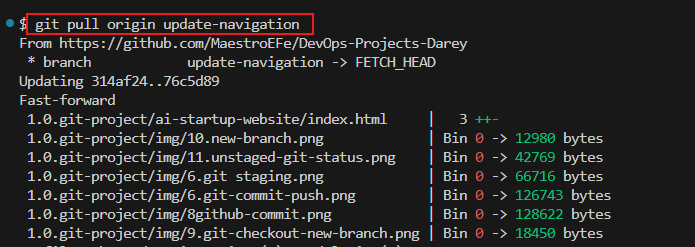

  This ensures that you have the latest updates from the repository, including Tom's merged changes, if any.

- Create a NEw baranch for Jerry's Work:

  `git checkout -b add-contact-info`

  this creates a new branch where Jerry will make his changes, keeping them separed from the `main` project until they are ready to be merged.

- Open `index.html` and add contact information:: Make your changes to the index.html file by adding contact information. This stimulates Jerry's task.
- Stage JErry's Changes:
  `git add index.html`
  This command stages the changes Jerry made to the `index.html` file, perpareing them for commit.
- Commit Jerry's Changes:
  `git commit -m "Add contact information"`

  This saves Jerry's changes in the branche's history, with a message describing what was done.

- Push Jerry's Branch to GitHub:
  `git push origin add-contact-info`

  

  This command uploads Jerry's Branch to the GitHub repository, making it available for review and merging into the main project

### 3. So far you have experienced collaboration betwen Tom and Jerry. But that is not all. Somenone needs to review their work, merge the changes to the main project, and resolve conflicts if any. In the next project, we will see how that work.