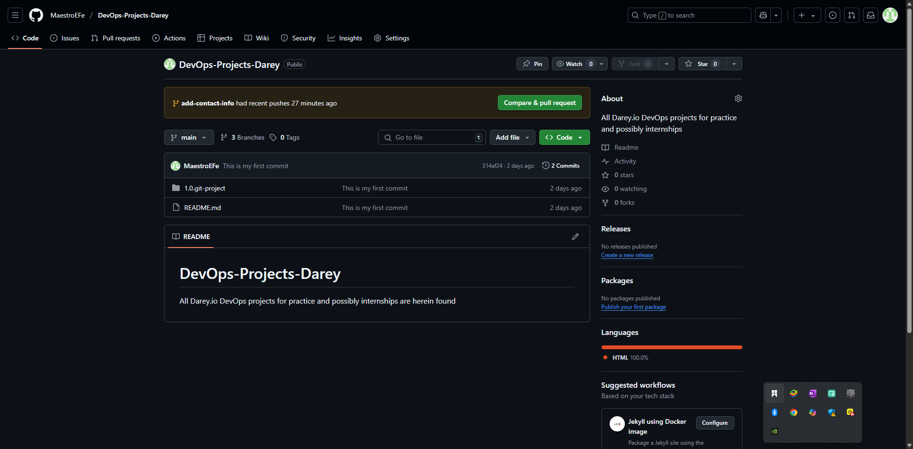
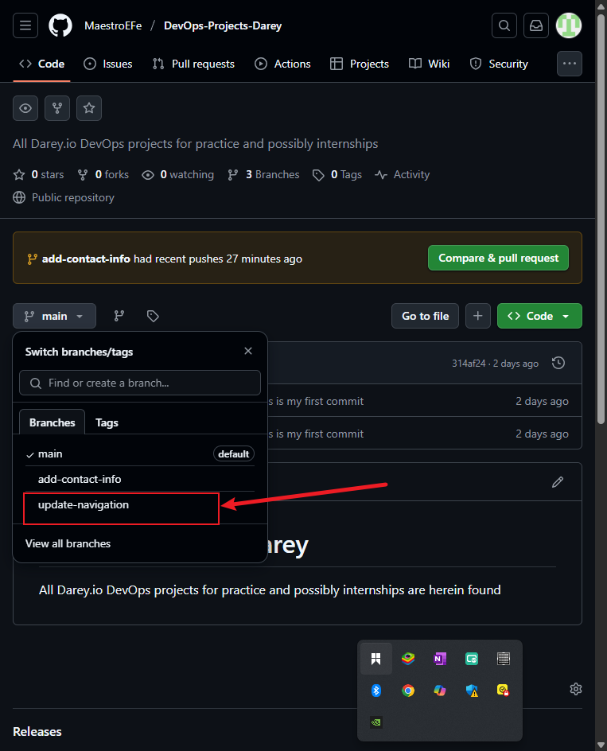
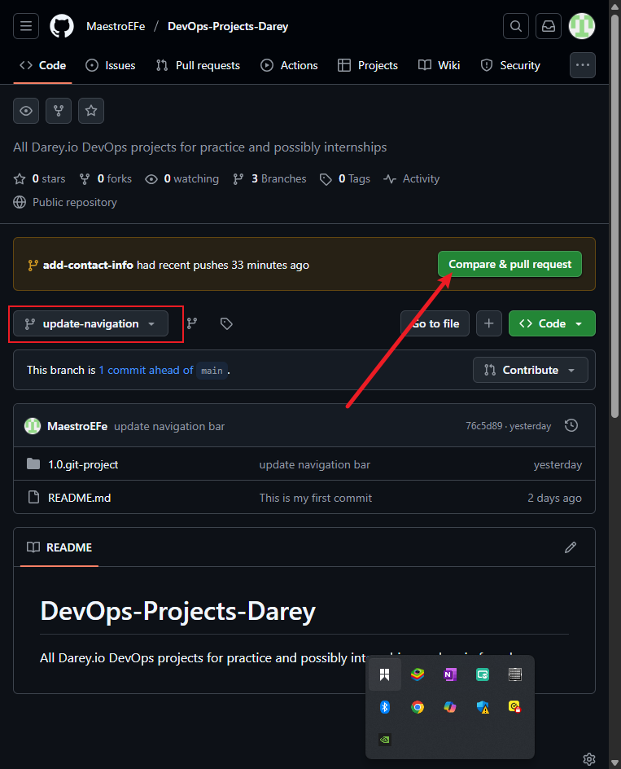
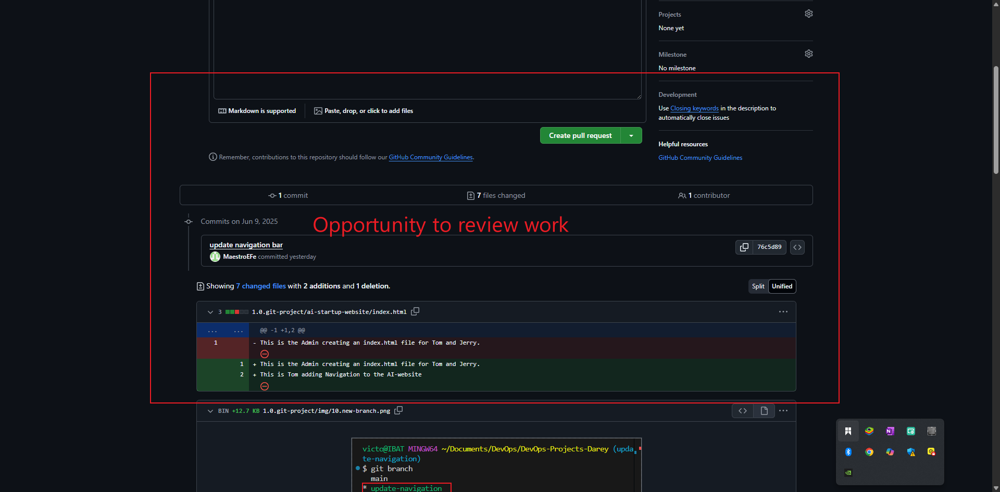
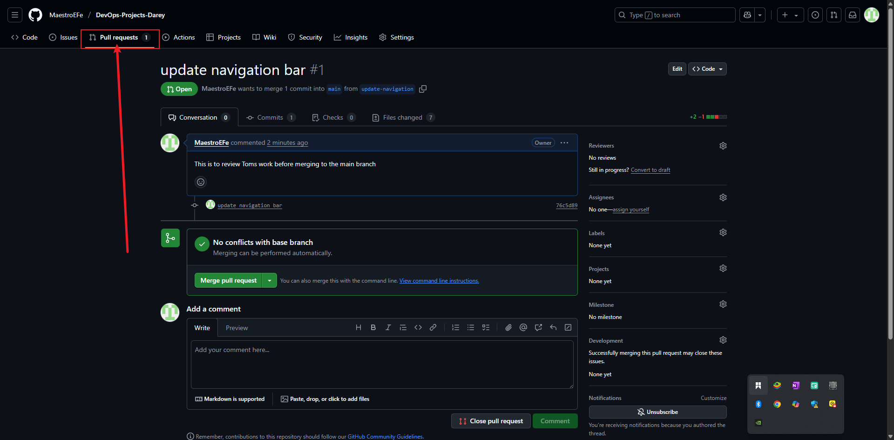
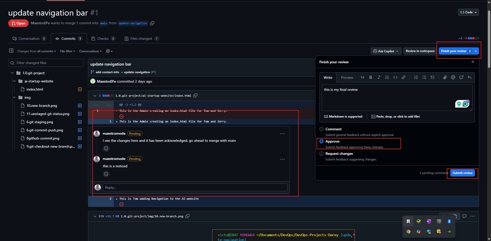
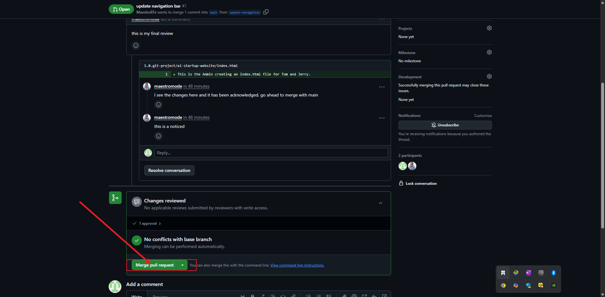
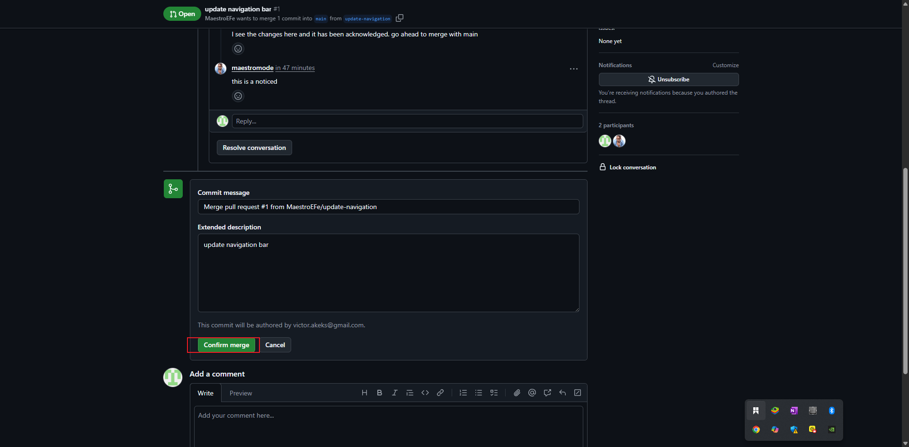

# Part 3: Merging Changes

Now that both Tom and Jerry have made their contributions in separate branches, it's time to review and merge these changes into the main project. And it includes;
1. Creating a Pull Request (PR)
2. Merging the PR into the main branch

## Understanding Pull Requests:

A *Pull Request (PR)* is a feature of GitHub that allows you to request changes to be merged from one branch into another. It's a way to collaborate with others on a project by suggesting changes and allowing them to review and approve those changes before they are merged into the main branch.

### How to create a pull request in GitHub:

#### 1. Go to your GitHub repository in a web browser

- Open your web browser and navigate to your GitHub repository

   

#### 2. Switch to the branch you want to create a pull request for

- Click on the branch name in the top left corner of the file list and select the branch Tom have been working on, in this case, *updarte-navigation* branch.

   

#### 3. Create a pull request

- Click on the "New pull request" button

   

- GitHub will take you to a new paga to initiate the pull request. It automatically selects the main project's branch and the compare branch.

#### 4. Review tom's pull request

- Before creatgeing the pull request, Tom would review his changes to ensure everything is correct. GitHub shows the difference between the tom's *updarte-navigation* branch and the main project's branch. It's a good opportunity for tom to double-check his work.

   

#### 5. Create the Pull Request

- If everything looks good, Tom can create the pull request by clicking on the "Create pull request" button.
- Provide a title and description for the pull request.

   

#### Reviewing and Merging Tom's Pull Request
Once the pull request is created, it becomes visible to other team members who can review the changes, leaving comments, and request additional changes if needed. (This is an example of what colaboration is about in DevOps). 



When the team agrees that the changes are ready and good to go, someone with merger permission can merge the pull request, incoporating the changes from Tom's *updarte-navigation* branch into the main project's branch.





Following the same process, Jerry would create a pull request for his *add-user-info* branch after Tom's changes have been merged, ensuring that the project stays up to date and conflicts are minimized.

#### Updating Jerry's Branch with the latest Changes

Before Jerry merges his changes into the main branch, it  is essential to ensure his branch is up-to-date with the main branch. This is because other changes (like tom's changes) might have been merged into the main branch after Jerry started working on his feature. Updating ensures compatinility and reduces the chances of conflicts.

#### Steps to update Jerry's Branch

1. On the terminal, Switch to Jerry's branch

   ```bash
   git checkout add-user-info
   ```
2. Pull the latest changes from the main branch:

   ```bash
   git pull origin main
   ```

Purpose: This comman fetches the changes from the main branch (Remember, main brabch now has Tom's changes) and merges them to jerry's **add-user-info** branch. It ensures that any update made to the main branch, like Tom's merged changes, are now included in jerry's branch. This step is crucial for avoiding conflicts and ensureing that jerry's work can smoothly integrate with the main project.
3. Merger the pull request to the main branch: Click the "Merge pull request" button on GitHub to merge Jerry's changes into the main main branch. this action combines Jerry's contribution with the rest of the project, completeing the colaboaretion, completing the collaborative workflow.

#### Finalizing Jerrys Contribution

Assuming there are no conflicts, Jerry's branch is now ready to be merged into the main branch. 

- Push the update Branch to GitHub:

   ```bash
   git push origin add-user-info
   ```
   
   This command uploads Jerry's changes to the GitHub repository. Now, his branch is up-to-date with the main branch, and it's ready to be merged.

   the *origin* keyword in the command refers to the default name Git gives to the remote repository from which you clone your project. It's like a shortcut or an alias for the full url of the 
   repository in GitHub.

   - Create the Pull Request (PR) for Jerry's changes, similar to Tom's process.

   - Merge Jerry's Pull Request. Complete the process by merging the PR into the main branch.

   This simulated workflow illustrates how Git facilitates collaborative developement, allowing multiple developers to work on a project simultaneously while maintaining a clear history of changes and contributions, even when working on same files.

# Some Other Gits Commands

## Change Branch Name

```bash
git branch -m old-branch-name new-branch-name #  where -m means "move"

# Alternatively if you are on the branch you want to rename

```bash
git branch -M new-branch-name # where -M means "move"
```
