# Introduction to Linux

In the dynamic landscape of technology, mastering the fundamentals is essential for anyone aspiring to excel in fields such as DevOps, Cloud Computing, Cybersecurity, Data Analytics, AI, Machine Learning, and QA Testing. This project is designed to provide a solid foundation in Linux, a crucial skillset for technology professionals. Understanding these technical fundamentals lays the groundwork for success in various tech-centered careers.

## What is Linux?

Linux is a free, open-source operating system similar to Windows or macOS, but it's more widely used for servers, supercomputers, and embedded devices. It's known for its stability, security, and customizability, allowing users to modify and distribute their own versions. Linux runs on a wide range of hardware and devices, from desktops and servers to mobile devices and embedded systems, and powers much of the internet's infrastructure. It is supported by a global community of developers who contribute to its many distributions, each tailored for specific needs or preferences. Linux is the foundation of many popular operating systems, including Ubuntu, Fedora, and Debian, which are different distributions of Linux.

## Why Linux?

Linux is the preferred operating system for professionals in technology fields including:

- **Server Infrastructure**: Powers over 90% of the world's cloud infrastructure
- **Development Environment**: Offers powerful command-line tools and scripting capabilities
- **Security**: Provides robust security features and frequent updates
- **Cost-Effective**: Free and open-source with no licensing fees
- **Customization**: Highly customizable to meet specific needs
- **Community Support**: Backed by a large, active community of developers

Major technology companies like Google, Amazon, and Facebook rely on Linux for their infrastructure, making it an essential skill for IT professionals.

## Linux Distributions

Linux distributions, often referred to as "distros", are different versions of the Linux operating system built around the Linux kernel. Each distribution is tailored for specific needs or preferences, offering different configurations, desktop environments, package managers, and software repositories. Key characteristics of Linux distributions include:

- **Package Management**: Different package managers (apt, yum, dnf, etc.)
- **Release Cycles**: Varying release schedules and support periods
- **Default Software**: Different pre-installed applications and tools
- **Target Audience**: Ranging from beginner-friendly to expert-oriented

Popular Linux distributions include Ubuntu, CentOS, Fedora, and Debian, each with its own strengths and use cases.

## Popular Linux Distributions

### Ubuntu

**Based on:** Debian  
**Package Manager:** APT (Advanced Package Tool)  
**Best for:** Beginners, Desktops, Cloud Computing  

Ubuntu is one of the most popular Linux distributions, known for its user-friendly interface and extensive documentation. It offers:

- Regular releases every six months with long-term support (LTS) versions every two years
- Large software repository with thousands of free applications
- Strong community support and extensive documentation
- Excellent hardware compatibility

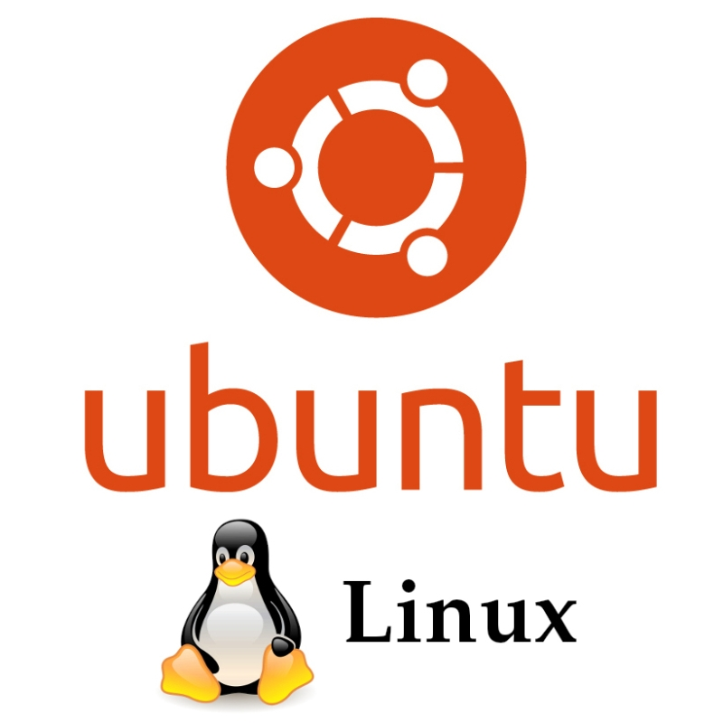

### CentOS

**Based on:** RHEL (Red Hat Enterprise Linux)  
**Package Manager:** YUM/DNF  
**Best for:** Enterprise Servers, Web Hosting  

CentOS (Community ENTerprise Operating System) is a stable, predictable, and reproducible platform derived from RHEL:

- Free alternative to Red Hat Enterprise Linux
- Long-term support with security updates
- Ideal for production servers and enterprise environments
- Focuses on stability over cutting-edge features

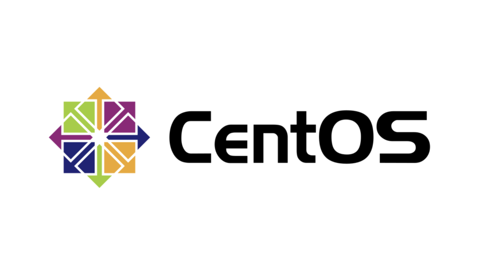

### Fedora

**Based on:** RHEL (Upstream)  
**Package Manager:** DNF  
**Best for:** Developers, Cutting-edge Technology  

Fedora serves as a testing ground for technologies that may eventually be included in RHEL:

- Features the latest software versions
- Strong focus on open-source principles
- Excellent development tools and container support
- Regular six-month release cycle


### Debian

**Based on:** Independent  
**Package Manager:** APT  
**Best for:** Stability, Servers, Custom Distributions  

Debian is one of the oldest and most influential Linux distributions:

- Strict adherence to free software principles
- Extremely stable with long release cycles
- Serves as the foundation for many other distributions (including Ubuntu)
- Supports a wide range of hardware architectures


## Installation and Initial Setup

In this section, we will create a cloud server and establish a connection to it from our local environment. Your local environment can be any operating system (Windows, macOS, or Linux) that you're currently using to access this guide.

The setup is as shown below:


We will use *AWS* (Amazon Web Services) to create a cloud server. For now, focus on the Linux aspects rather than AWS specifics, as AWS will be covered in more detail later.

AWS provides a free tier virtual server called EC2 (Elastic Compute Cloud), which we'll use for our Linux environment.

## Package Managers

Package managers in Linux are essential tools that automate the process of installing, updating, configuring, and removing software packages. They handle dependencies and ensure that software is properly installed and configured on your system.

### Common Package Managers

#### APT (Advanced Package Tool)
- **Used by**: Debian, Ubuntu, and derivatives
- **Key Commands**:
  ```bash
  sudo apt update          # Update package lists
  sudo apt install <pkg>   # Install a package
  sudo apt upgrade         # Upgrade all upgradable packages
  sudo apt remove <pkg>    # Remove a package
  ```

#### YUM (Yellowdog Updater Modified)
- **Used by**: Older Red Hat-based distributions (RHEL, CentOS 7)
- **Key Commands**:
  ```bash
  sudo yum update          # Update all packages
  sudo yum install <pkg>   # Install a package
  sudo yum upgrade         # Upgrade packages
  sudo yum remove <pkg>    # Remove a package
  ```

#### DNF (Dandified YUM)
- **Used by**: Newer Red Hat-based distributions (Fedora, RHEL 8+, CentOS 8+)
- **Key Commands**:
  ```bash
  sudo dnf update          # Update all packages
  sudo dnf install <pkg>   # Install a package
  sudo dnf upgrade         # Upgrade packages
  sudo dnf remove <pkg>    # Remove a package
  ```

### Package Management Best Practices
1. Always update your package lists before installing new software
2. Regularly update your system to get security patches
3. Only install software from trusted repositories
4. Clean up unused packages to save disk space
5. Understand the dependencies before removing packages

## Setting Up Your Development Environment

### Prerequisites for Connecting to EC2

Before connecting to your EC2 instance, you'll need:

1. **SSH Client**: A program to establish secure connections to your server
2. **Key Pair**: The `.pem` file you downloaded during EC2 instance creation
3. **Instance Details**: Public IP address or DNS of your EC2 instance

### Installing SSH Clients

#### Windows Users

Windows users need to install an SSH client. Recommended options include:

1. **MobaXterm** (Recommended)
   - Download from: [MobaXterm Official Site](https://mobaxterm.mobatek.net/)
   - Features built-in X server and tabbed interface
   
   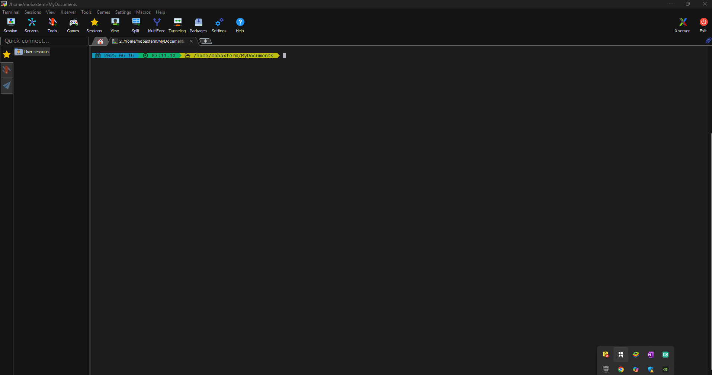

2. **Alternative SSH Clients**
   - [PuTTY](https://www.chiark.greenend.org.uk/~sgtatham/putty/latest.html)
   - [Bitvise](https://www.bitvise.com/ssh-client)
   - [Git Bash](https://git-scm.com/download/win) (Included with Git for Windows)
   - [Windows Terminal](https://docs.microsoft.com/en-us/windows/terminal/) (Modern terminal application)

#### macOS and Linux Users

Both macOS and Linux come with built-in terminal and SSH client. You can access the terminal through:

- **macOS**: `Applications > Utilities > Terminal` or search for "Terminal"
- **Linux**: Typically `Applications > Utilities > Terminal` or press `Ctrl+Alt+T`

## Connecting to Your EC2 Instance

### Understanding the Connection Process

When connecting to your EC2 instance, three main components work together:

1. **SSH Client**: The software you use to establish the connection
2. **Key Pair Authentication**: Uses your private key (`.pem` file) to verify your identity
3. **Instance Access**: Requires the instance's public IP address/DNS and the appropriate username

### Step-by-Step Connection Guide

1. **Locate Your Key Pair**
   - Find the `.pem` file you downloaded during EC2 instance creation
   - It's typically in your `Downloads` folder
   - Example: `~/Downloads/your-key-pair.pem`

2. **Set Proper Permissions** (Linux/macOS only)
   ```bash
   chmod 400 ~/Downloads/your-key-pair.pem
   ```
   This ensures only you can read the private key.

3. **Find Your Instance's Public IP**
   - Go to AWS EC2 Console
   - Select your instance
   - Find the "Public IPv4 address" or "Public IPv4 DNS"
   
   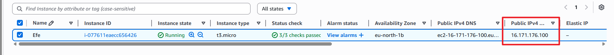

4. **Connect Using SSH**
   
   The basic connection command is:
   ```bash
   ssh -i /path/to/your-key-pair.pem username@public-ip-address
   ```
   
   For Ubuntu instances, the default username is `ubuntu`:
   ```bash
   ssh -i ~/Downloads/your-key-pair.pem ubuntu@12.34.56.78
   ```

   **Command Breakdown**:
   - `ssh`: Secure Shell protocol
   - `-i`: Specifies the identity (private key) file
   - `username`: Default is `ubuntu` for Ubuntu-based AMIs
   - `@public-ip-address`: Your instance's public IP or DNS

5. **First Connection Warning**
   When you connect for the first time, you'll see a message like:
   ```
   The authenticity of host '12.34.56.78 (12.34.56.78)' can't be established.
   ECDSA key fingerprint is SHA256:xxxxxxxxxxxxxxxxxxxxxxxxxxxxxxxxxxxxxxxxxxx.
   Are you sure you want to continue connecting (yes/no/[fingerprint])?
   ```
   Type `yes` and press Enter.

6. **Successful Connection**
   You should see a welcome message and a command prompt like:
   ```
   Welcome to Ubuntu 22.04 LTS (GNU/Linux 5.15.0-1011-aws x86_64)
   
   ubuntu@ip-172-31-22-123:~$
   ```
   
   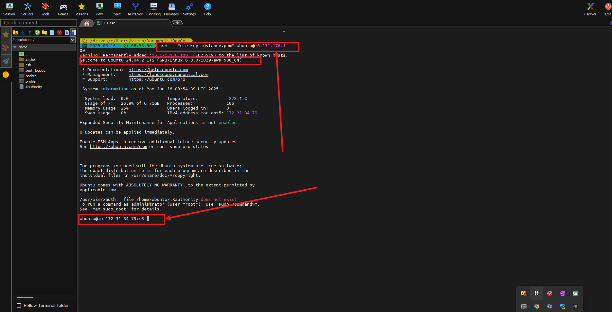

### Troubleshooting Connection Issues

- **Permission Denied (publickey)**: 
  - Verify the key pair name matches the one used when launching the instance
  - Ensure you're using the correct username for your AMI type
  
- **Connection Timed Out**:
  - Check if your security group allows inbound SSH (port 22) from your IP
  - Verify the instance is in the running state
  
- **Unprotected Private Key File**:
  - On Linux/macOS, ensure your key has the correct permissions (400)
  
- **Server Refused Our Key**:
  - The key pair might not be properly associated with the instance
  - You may need to terminate the instance and launch a new one with the correct key pair


## Working with Package Management

Package managers are essential tools in Linux that handle the installation, configuration, upgrading, and removal of software packages. They automatically resolve dependencies and ensure proper installation, making software management efficient and reliable.

### Understanding Package Management

#### What is a Package Manager?
A package manager is a collection of software tools that automates the process of installing, upgrading, configuring, and removing computer programs for a computer's operating system in a consistent manner.

#### Why Use a Package Manager?
- **Dependency Resolution**: Automatically handles required libraries and dependencies
- **Version Control**: Manages software versions and updates
- **Security**: Verifies package authenticity and provides security updates
- **Efficiency**: Simplifies software management through a centralized system

### Common Package Managers

#### 1. APT (Advanced Package Tool)
**Used in**: Debian, Ubuntu, and derivatives  
**Key Commands**:

```bash
# Update package lists from repositories
sudo apt update

# Upgrade all installed packages
sudo apt upgrade

# Install a new package
sudo apt install package-name

# Remove a package
sudo apt remove package-name

# Search for packages
apt search search-term

# Show package information
apt show package-name
```

#### 2. YUM (Yellowdog Updater Modified)
**Used in**: Older Red Hat-based distributions (RHEL 7, CentOS 7)  
**Key Commands**:

```bash
# Update all packages
sudo yum update

# Install a package
sudo yum install package-name

# Remove a package
sudo yum remove package-name

# Search for packages
yum search search-term

# Show package information
yum info package-name
```

#### 3. DNF (Dandified YUM)
**Used in**: Modern Red Hat-based distributions (Fedora, RHEL 8+, CentOS 8+)  
**Key Commands**:

```bash
# Update all packages
sudo dnf update

# Install a package
sudo dnf install package-name

# Remove a package
sudo dnf remove package-name

# Search for packages
dnf search search-term

# Show package information
dnf info package-name
```

### Practical Package Management Examples

#### Installing Software
To install the `nginx` web server:

```bash
# For Debian/Ubuntu
sudo apt update
sudo apt install nginx


# For RHEL/CentOS 7
sudo yum install epel-release
sudo yum install nginx

# For Fedora/RHEL 8+/CentOS 8+
sudo dnf install nginx
```
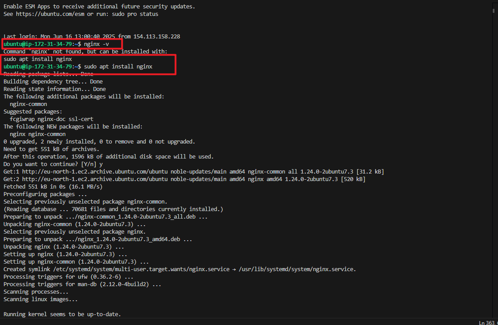
This shows the nginx installation process. First nginx is checked to see if it is installed. If not, it is installed.

#### Verifying Installation
Check if the service is running:

```bash
# Check status of nginx
sudo systemctl status nginx

# Start nginx if not running
sudo systemctl start nginx

# Enable nginx to start on boot
sudo systemctl enable nginx
```
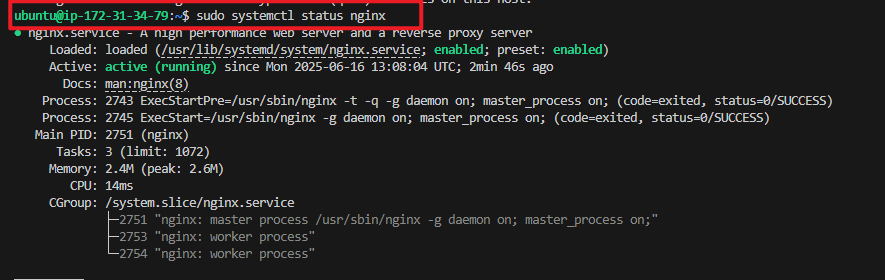

#### Updating Packages
Keep your system up-to-date:

```bash
# Update package lists (Debian/Ubuntu)
sudo apt update

# Upgrade all installed packages
sudo apt upgrade

# For RHEL-based systems
sudo yum update    # or sudo dnf update
```
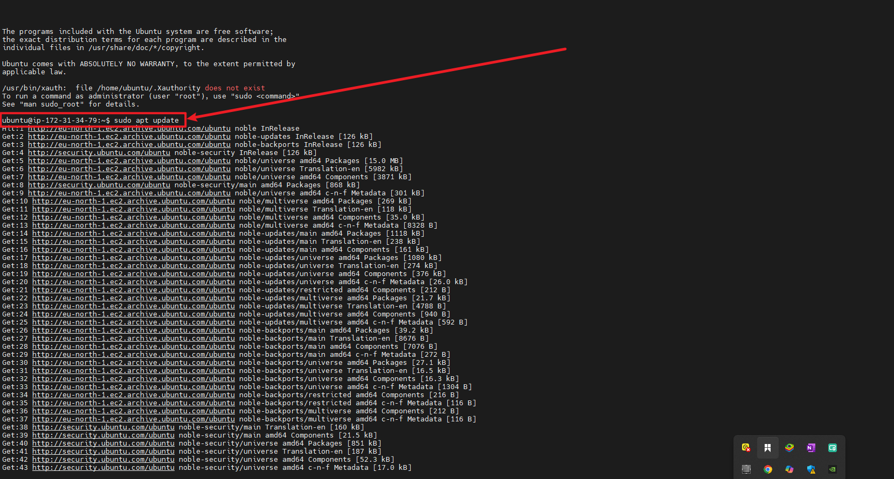

#### Removing Software
To remove a package:

```bash
# For Debian/Ubuntu
sudo apt remove package-name

# For RHEL-based systems
sudo yum remove package-name    # or sudo dnf remove
```
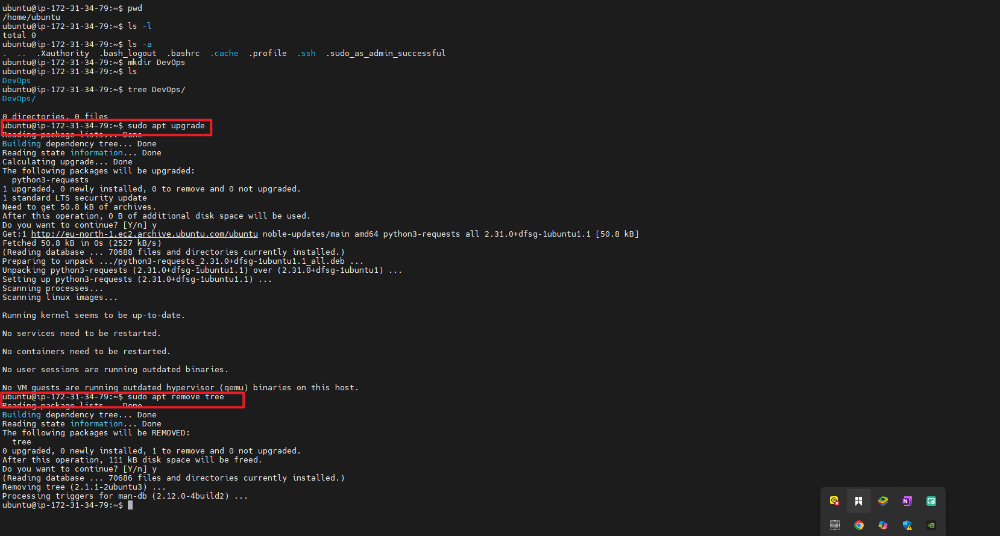
### Package Management Best Practices

1. **Regular Updates**
   - Update your package lists frequently
   - Apply security updates promptly

2. **Clean Up**
   - Remove unused packages to free up space
   - Clear the package cache periodically
   ```bash
   # For Debian/Ubuntu
   sudo apt autoremove
   sudo apt autoclean
   
   # For RHEL-based
   sudo yum autoremove    # or sudo dnf autoremove
   sudo yum clean all     # or sudo dnf clean all
   ```

3. **Security**
   - Only install packages from trusted repositories
   - Verify package signatures when possible
   - Be cautious with third-party repositories

4. **Troubleshooting**
   - If you encounter dependency issues, try:
     ```bash
     # For Debian/Ubuntu
     sudo apt --fix-broken install
     
     # For RHEL-based
     sudo yum-complete-transaction
     ```

### Practice Exercise: Install and Configure Nginx

1. Install Nginx using your distribution's package manager
2. Start the Nginx service
3. Enable Nginx to start on boot
4. Verify it's running by accessing your server's IP in a web browser
5. (Optional) Configure a simple static website

```bash
# Example for Ubuntu
sudo apt update
sudo apt install nginx
sudo systemctl start nginx
sudo systemctl enable nginx
```
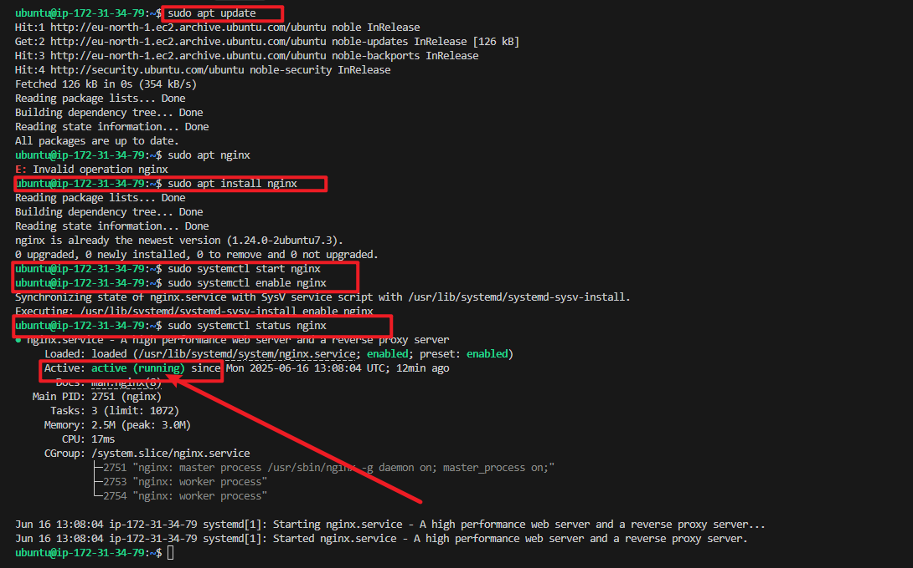

After installation, open a web browser and navigate to your server's IP address. You should see the default Nginx welcome page.


### Troubleshooting Nginx Connection Issues

If you encounter a "refused to connect" error when trying to access your Nginx server, follow these steps to resolve the issue:

1. **Check Nginx Status**
   ```bash
   sudo systemctl status nginx
   ```

2. **Enable UFW (Uncomplicated Firewall) and Allow Nginx**
   ```bash
   sudo ufw enable
   sudo ufw allow 'Nginx Full'
   sudo ufw status  # Verify the rules are applied
   ```
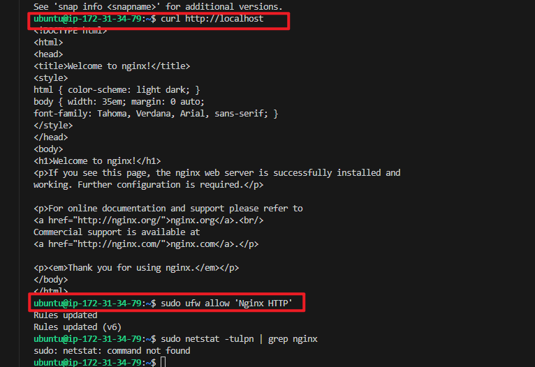

3. **Check AWS Security Group Settings**
   - Go to AWS EC2 Console
   - Select your instance
   - In the "Security" tab, click on the security group
   - Click "Edit inbound rules"
   - Ensure these rules exist:
     - Type: HTTP, Port: 80, Source: 0.0.0.0/0
     - (Optional) Type: HTTPS, Port: 443, Source: 0.0.0.0/0

4. **Verify Nginx is Listening**
   ```bash
   sudo netstat -tulpn | grep nginx
   ```
   You should see Nginx listening on port 80 (0.0.0.0:80 or :::80)

5. **Check Nginx Error Logs**
   ```bash
   sudo tail -f /var/log/nginx/error.log
   ```

After completing these steps, you should be able to access your Nginx welcome page by entering your server's public IP in a web browser.

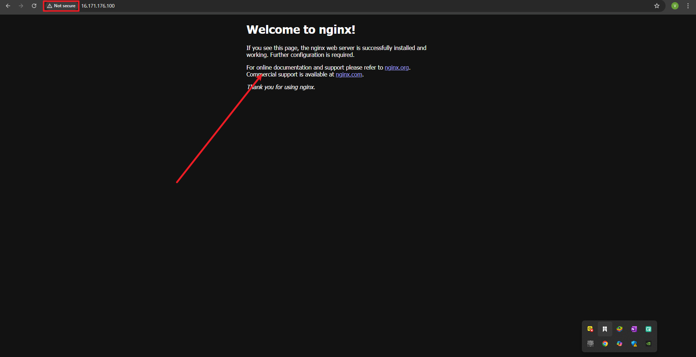

In the next step, we would look more intor hands on project that involves the use of commands on linux system. working with Linux commands typically includes tasks such as 
- navigating the file system, 
- managing files and directories and
- manipulating permissions.