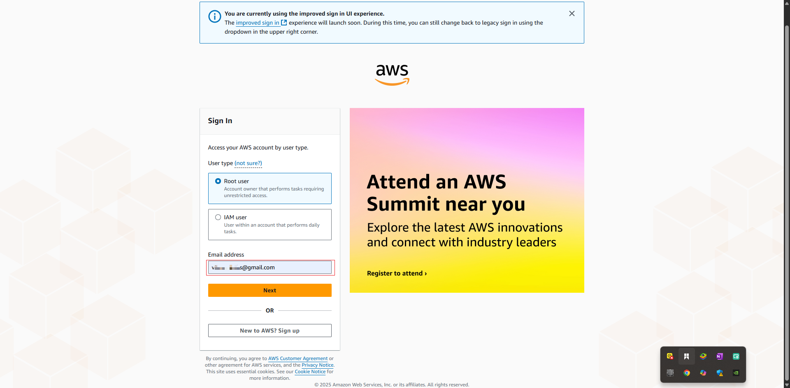
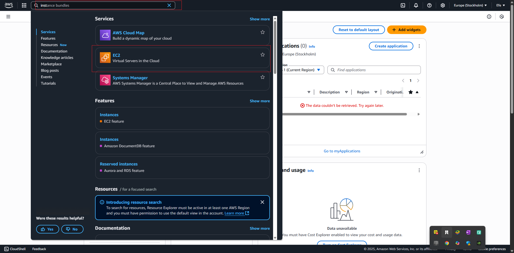
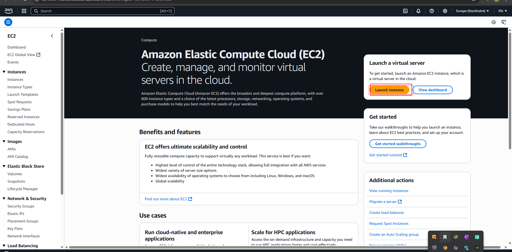
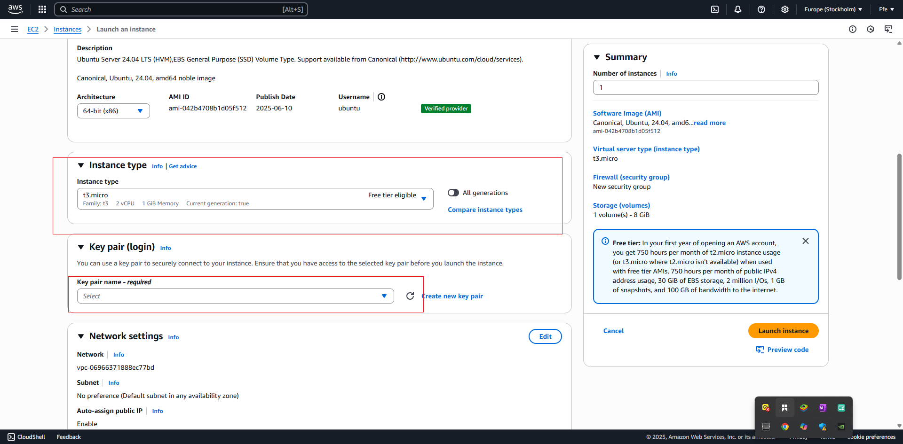
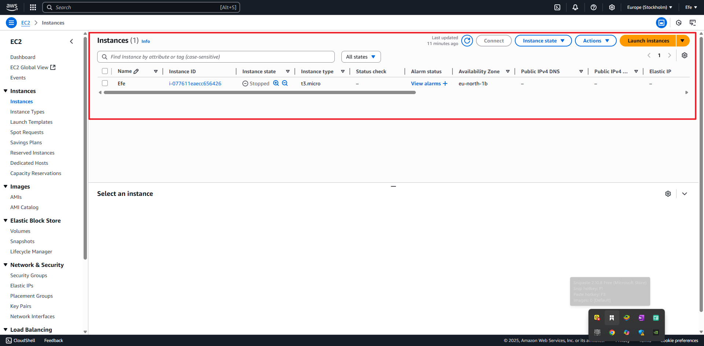
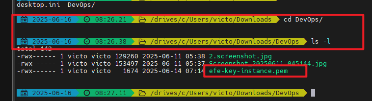
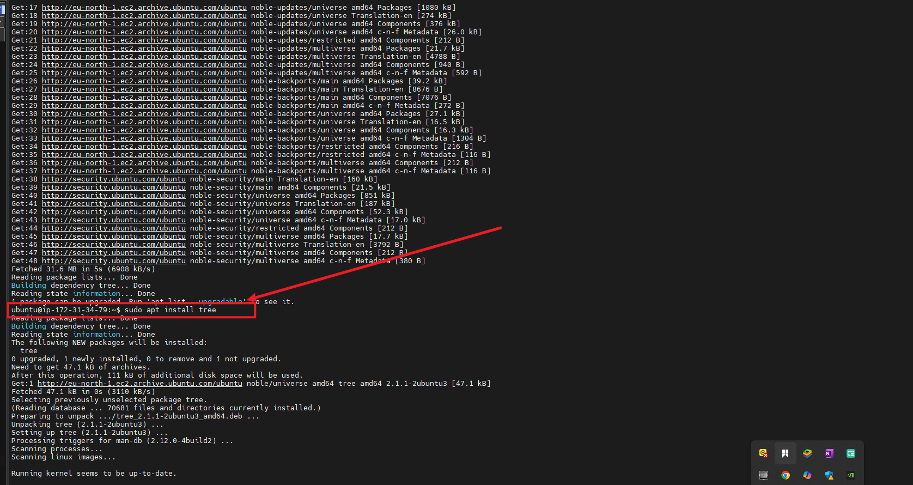
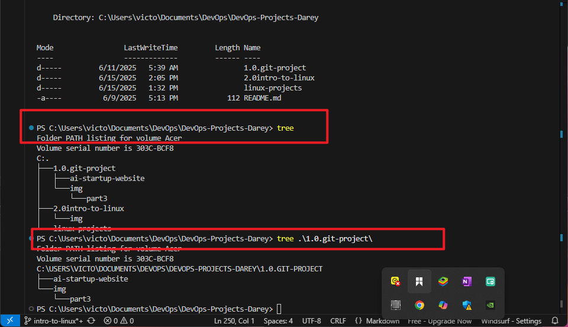
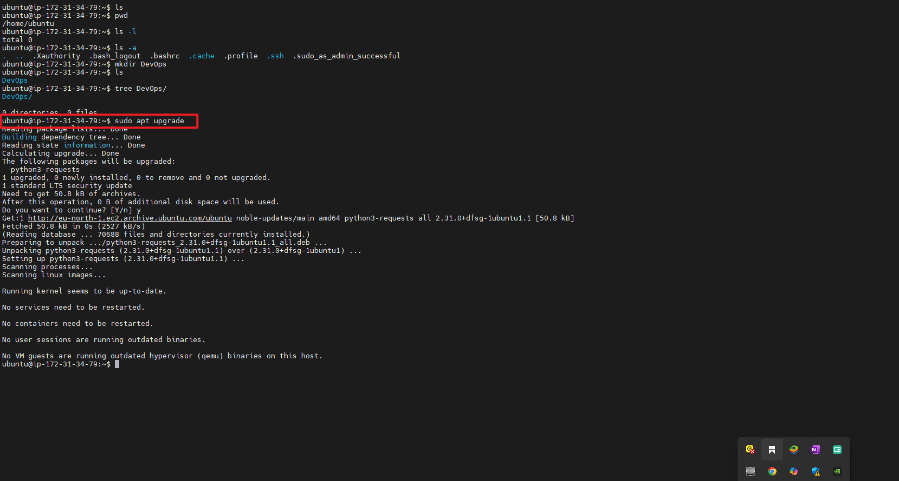

# 2.0 intro to Linux
# INTRODUCTION TO LINUX

In the dynamic landscape of technology, mastering the fundermentals is essential for anyobe aspiring to excel in the fields such as Devops, Cloud Computing, Cybersecurity, Data Analytics, AI, Machine Learning, AI, and QA Testing. This project is designed to equip with a solid foundation in Linux, a crucial skillset for professionals in these domains. Understanding the tech from the basics lays the groundwork for success in various tech-centered careers.

## What is Linux?
Linus is a free, open-source operating system similar to windows or macOS, but it's more widely used for servers, supercomputers, and embedded devices. It's know for it's stability, security, and customizability, allowing users to modify and distribute thier versions. Linus runs on a wide range of hardware/devices, from desktops and servers to mobile devices embedded systems, and powers much of the internet's infrastructure. It is supported by a global community of developers who contributes to its many distributions, each tailoerd for specific needs or preferences. Linux is the foundation of many popular operating systems, including Ubuntu, Fedora, and Debian which are different distributions of Linux.

## Why Linux?

Linux is a popular choice for professionals in the fields of DevOps, Cloud Computing, Cybersecurity, Data Analytics, AI, Machine Learning, AI, and QA Testing. It is a powerful and flexible operating system that is used by many of the world's largest companies, including Google, Amazon, and Facebook. It is also a popular choice for individuals who want to learn about operating systems and how they work.

## Linux Distributions

Linux distributions, often referred to as `"distros"`, are different versions (flavours ) of the Linux operating system built by different companies or organizations using the Linux kernel. Each distro is tailored for specific needs or preferences. They offer differnt configurations, desktop environments, and package managers, and software repositories, and then they are branded. Some popular Linux distributions include Ubuntu, CentOS, Fedora, and Debian.

## Popular Linux Distributions

### Ubuntu
Ubuntu is a popular Linux distribution that is based on Debian. It is known for its ease of use and its support for a wide range of hardware. It is also a popular choice for professionals in the fields of DevOps, Cloud Computing, Cybersecurity, Data Analytics, AI, Machine Learning, AI, and QA Testing. It is the most popular Linux distribution and is used by many of the world's largest companies, including Google, Amazon, and Facebook. It's an excelent choich for beginners and professionals alike. 


### CentOS
CentOS is a popular Linux distribution that is based on Red Hat Enterprise Linux (RHEL). It is favoured in enterprises and server environments.  due to it's stability and long-term support. It is essentially a free and open-source version of Red Hat Enterprise Linux (RHEL) which is another distro itself, but requires paid license for production use. System administrators oftern choose centors because it is free, reliable and robust.


### Fedora
Fedora is a popular Linux distribution that is based on Red Hat Enterprise Linux (RHEL). It is known for its stability and its support for a wide range of hardware. It is also a popular choice for professionals in the fields of DevOps, Cloud Computing, Cybersecurity, Data Analytics, AI, Machine Learning, AI, and QA Testing. It is the most popular Linux distribution and is used by many of the world's largest companies, including Google, Amazon, and Facebook. It's an excelent choich for beginners and professionals alike. 


### Debian
Debia is also know for it's commitment to free and open=source software principles. Makes Linux available for free, provide a wide range of software prackages and support multiple hardware archetictures.


### Fedora
Fedora is a cutting-edge distribution that focuses on integrating the lates software and technologies. It's a great choic for those who want to experiment with new features and applications. Fedora also serves as a testing ground for new software for Red Hat's Enterprise Linux products.


## Instalation and Initial Setup (Configuration)

In this section, we will create a server in the clud, and gain access to it from our local environment. When we say "Local environment", we mean our computer which could be windows or mac operating system in most cases, or even linux itself.

The setup is as shown below:


We will user *AWS* (Amazon Web Services) to create a server in the cloud. For now, do not worry about trying to learn AWS as that will be dealt with much later along the line.

Rught now, all that is needed is to have a *Linux* server in the cloud, and gain access to it from our local environment.

AWS can provide us with a free virual server called EC2 *(Elastic Compute Cloud)*.

### Let us create an EC2 instance, i.e., a remote linux server

You may watch the video below to ger yourself set up.

- [AWS account setup and provisioning an Ubuntu Server](https://www.youtube.com/watch?v=xxKuB9kJoYM)

- [Connecting  to your EC2 instance](https://www.youtube.com/watch?v=TxT6PNJts-s)

Or follow the guidline I provide below:

- i. Register a new AWS account following this Instruction: https://aws.amazon.com/premiumsupport/knowledge-center/create-and-activate-aws-account/

- ii. sign in to your AWS account.



- iii.  on the top left select services and search for "Elastic cloud compute (EC2)".



- iv. From the menue on the left side, select "Instances" and click on "Launch Instance".

- v. Click on "Launch Instance"



- vi. select the AMI (Amazon Machine Image) to use. For this project, we will use the free tier eligible AMI.


- vii. Select the instance type. For this project, we will use the t2.micro instance.


- viii. Configure the instance details. For this project, we will use the default settings.

- ix. Add storage. For this project, we will use the default settings.

- x. Add tags. For this project, we will use the default settings.

- xi. Configure security group. For this project, we will use the default settings.

- xii. Review and launch. For this project, we will use the default settings.

- xiii. Launch. For this project, we will use the default settings.

- xiv. Select an existing key pair or create a new one. For this project, we will use the default settings.



- xv. Download the key pair. For this project, we will use the default settings.

- xvi. Launch the instance. For this project, we will use the default settings.



- xvii. Wait for the instance to start. For this project, we will use the default settings.


- Follow this video to see a step by step guide for createing and connecting to your EC2 instance: 

[](https://www.youtube.com/watch?v=86Tuwtn3zp0)


- ## Connect to the server (EC2 instance)
Now it's time to get onto the server you have just created in the cloud. You will need a number of things to setup depending on your operating system.

1. *A clinent tool:* A client tool is a program on your computer that lets you communicate and give commands to a remote server. Imagaine it as a doorway on your laptop tht allows you to speak to a far-off computer as if it were right in front of you. By typing commands into a terminal, you can ask the remote server to perform tasks, retrieve data, or even run programs, all without being physically present near the server. This is especially useful for managin websites, running software, or accessing files from anywhere in the world, just by using simple text commands.

2. *A secure protocol:* A secure protocol is like a protected path over the internet that ensures the information you send from your computer to another remote server is safe from prying eyes. Imagine sending a secrete letter through a series of locked, armored vehicles instead of a regular open road; that's what a secure protocol does for your data. It encrypts, or scrambles your information so that only the intended recipient, the remote server, can understand it. The populare protocol for this purpose is called SSH (Secure Shell). 

3. *A key pair:* A key pair is a pair of files that are used to authenticate your identity when connecting to a remote server. The public key is stored on the remote server, and the private key is stored on your computer. When you connect to the remote server, the server uses your public key to verify your identity, and then grants you access to the server. The private key is never shared with anyone, and it is used to encrypt the data you send to the remote server.

## Client tools to install

### Windows

if you are on windows, you will need to have tools such as [MobaXterm](https://mobaxterm.mobatek.net/) installed. There are many other options such as:


- [PuTTY](https://www.chiark.greenend.org.uk/~sgtatham/putty/latest.html)
- [Bitvise](https://www.bitvise.com/ssh-client)
- [Git Bash](https://git-scm.com/download/win) which is available by default on windows 10 and later
- [Windows Terminal (powershell)](https://docs.microsoft.com/en-us/windows/terminal/)

For simplicity, we will focus only on *MobaXterm* which is perfect for all oure needs through out this Program

For MacOs users, client terminal is already available so you don't have to do anything. simply open up the terminal by navigating to `Applications > Utilities > Terminal`

For Linux users, client terminal is already available so you don't have to do anything. simply open up the terminal by navigating to `Applications > Utilities > Terminal`


## Connecting using SSH
Now that we have the terminal open, it's time to connect to the remote server we created earlier

Most client tools already have SSH installed, so you literally don't have to do anything other than simply typing the comman "ssh" on the terminal.

1. Open up the Terminal

2. Locate the *".pem"* file you downloaded earlier when we provisioned the EC2 instance.
    
    1. Assuming it got downloaded in the "Downloads" folder
    2. Use Linux command to navigate into that folder

        ```bash
        cd ~/Downloads
        ```
        Quick explantion of the above command:
        - *`cd`* : stands for "change directory", which is a command used to navigate between folders in the terminal.
        - *`~/Downloads`* : is the path to the "Downloads" folder in the user's home directory.
        - *`~`* : is a shortcut for the user's home directory.
        - *`Downloads`* : is the name of the folder where the *".pem"* file was downloaded.
    3. the name of my pem key is `efe-key-instance.pem`. We can run `ls 0l` command and it will show the list there.

    

    4. Extract the public IP address of the server you created from AWS

    

    5. Connect to the server using SSH

    ```bash
    ssh -i "efe-key-instance.pem" ubuntu@16.171.176.100
    ```
    Let's breakdown the command:

    *`ssh`* : stands for "secure shell", which is a protocol used to connect to a remote server and manage them over an unsecured network (the internet is an unsecured netwrok).

    *`-i`* : stands for "identity file", which is the path to the private key file used to authenticate the user. In this case, the "efe-key-instance.pem" is the private key file. This file is essential for providing your identity to the server without needing a password. The .pem file is often used when connecting to servers such as those hosted on AWS (Amazon Web Services).

    *`username@public IP address`* : is the username and public IP address of the remote server. `ubuntu` is the default username for AWS EC2 instances. And `public IP address` is the public IP address of the remote server. `16.171.176.100` is the public IP address of the remote server. The @ symbol separates the username from the server's address.

Once you establish a successful connections, you should see an output like the below which proves that you have successfully connected to your remote server.


## Package Managers
Most of  the times, when working on linux, there will be the need to install tools. Think about it, the servers are used to host websites, and there has to be a tool that will help in the rendering of the web pages. Some commonly used tool is called *Apache*,  *Nginx*, *Lighttpd*, *IIS*, *GlassFish*, *JBoss*, *IBM WebSphere*, *Oracle WebLogic*, *Tomcat*, *Resin*, *WildFly*. in this course, we will focus on *Nginx*.

Since the servers are not your regular computers where you can go to a browser to click and download, there is the need to have package managers that can help achieve this.

Package managers in Linux are tools that automate the process of installing, udating, configurating, and removing software packages on a Linux distributions.

### Commonly used package managers 
*APT (Advanced Package Tool)*: Used by Debian-based distributions such as Debian, Ubuntu, and derivatives. COmmands include `apt-get` and `apt`. You will get to use this a lot very soon.

*YUM (Yellowdog Updater Modified)* Originally used by Red Hat and CentOS, `YUM` is now largely replaced by `dnf` in modern Red Hat-based distributions. It simplifies package management by resolving dependencies just like `apt`.

*DNF (Dandified YUM)*: The successor to `YUM`, `DNF` is the default package manager for modern Red Hat-based distributions such as Fedora and CentOS. It provides a more user-friendly interface and better performance than `YUM`.

## Installing, Updating and Removing Software

Since we are already on an Ubuntu based server, lets explore how to install tools on a linux server.

1. *Update Package Lists* Before installing new software or updating existing packages it's important to refresh the package list

```bash
sudo apt update # update the package list. This  is for Debian/Ubuntu-based systems.
```

```bash
sudo yum update # For Red Hat/Fedora-based systems
```

Note: Ignore `sudo` for now. it will be explained later.


2. *Install Software Packages*

```bash
sudo apt install tree # For Debian/Ubuntu-based systems.
```

If you are on the other Linux distribution using `yum`, the command would be looking like this:

```bash
sudo yum install tree # For Red Hat/Fedora-based systems
```



3. *Verifying installed Packages* To confirm that the desired packages or software has been successfully installed, simply run the `tree` command, and spedify the path you want to see the tree structure.

For example:

```bash
tree /path
```



Play arround with the tool and specify different folders on the server.

4. *Update Installed Packages*: Keep your system up-to-date by updating the installed packages

```bash
sudo apt upgrade
```



5. *Remove Sofware Packages*: To remove the `tree` package we installed ealier, run the below command

```bash
sudo apt remove tree
```


Practice: Explorign other tools on linux an d practing everything again. FOr example, install the tool `nginx`.

In the next stepk we would look more intor hands on project that involves the use of commands on linux system. working with Linux commands typically includes tasks such as 
- navigating the file system, 
- managing files and directories and
- manipulating permissions.