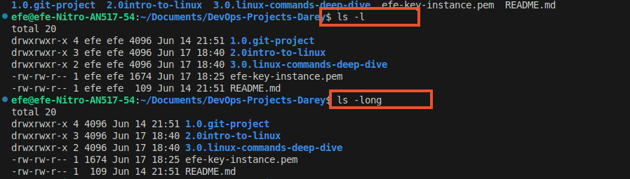
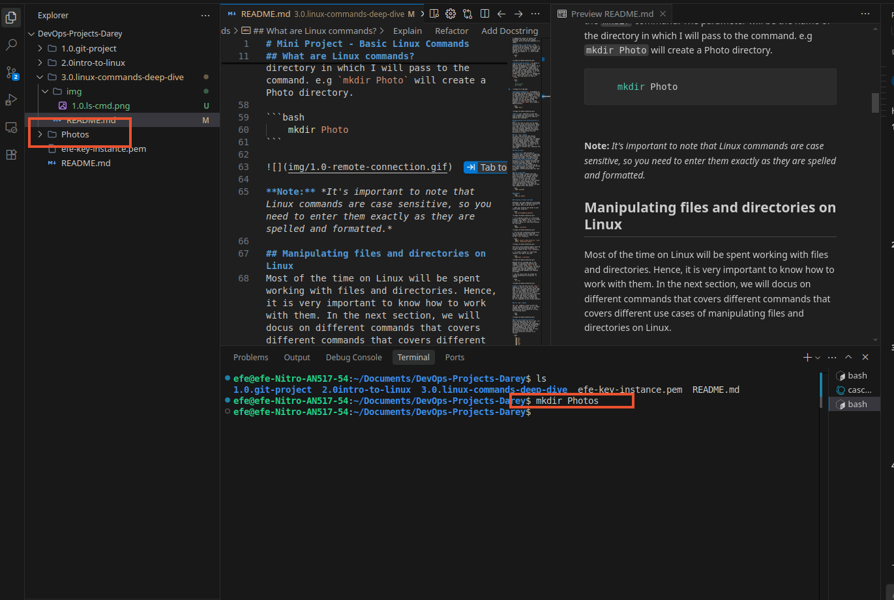
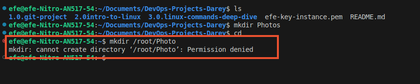
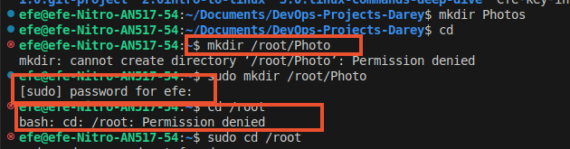
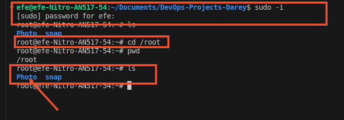
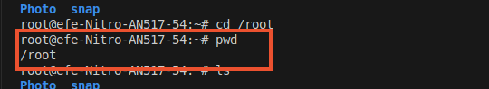
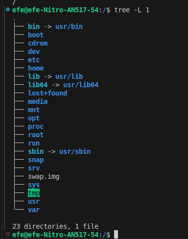
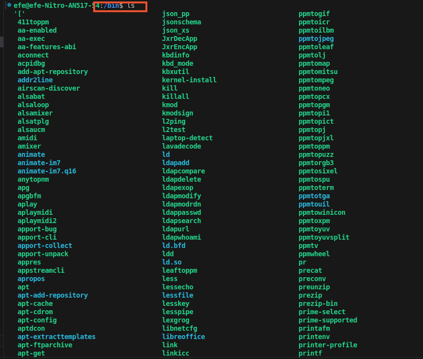
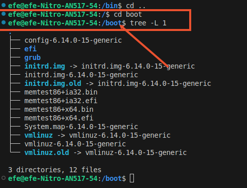

# Mini Project - Basic Linux Commands

## Linux commands Deep Dive

**Now that you have a client terminal and and have access to our remote server, what next?**

In this project, we will be learning the basic Linux commands and their usage.

for the next coupe of preject we will be learning a lot about Linux commands, therefore, it,s tune to get our hands dirty with the commands.

## What are Linux commands?
A linux command is a program that performs a specific task. It is a utility/program that runs in the command line interface (CLI). The CLI is a text-based envireonment where you interact with the system by typint commands.

Linux commands are executed by entering text in the terminal and pressing Enter. The text is called a command, and it is executed by the shell, which is a program that interprets the command and runs it.

Linux commands are executed by entering text in the terminal and pressing Enter. These commands enables you to perfom a wide range of tasks, including installing packages, managing users, manipulating files and directories, configuring system settings, and more.

The general syntax of a Linux command is as follows:

```bash
command [option(s)/flag(s)/switch(es)] [argument(s)/parameter(s)]
```

where

- command : the name of the command to be executed
- option(s)/flag(s)/switch(es) : optional parameters that modify the behavior of the command
- argument(s)/parameter(s) : required parameters that provide input data to the command

we can write the general syntax of a Linux command as follows for short 

```bash
command [option(s)] [parameter(s)]
```

A command may consits of options and parameters, but they are not always required. here are the key components of a comman:

**Command Name or Operation** : This represents the action or task you want to perform using the command. For example, if you wish to list the files in a foler, the command to call is the `ls` command. The name of the command is `ls` which stands for list.

```bash
	ls
```


**Options/Flags/Switches** : An option or flag or switch, as it may be called, modifies the behaviour of a command. It is typically preceeded by a single dash (-) or double dash (--). The single dash is used for short options, while the double dash is used for long options. it is used to customize the functionality of a command. For example, the `ls` command has a `-l` option that lists files in long format. The long option for this is `--long`.

```bash
	ls -l

    #Long option
    ls --long
```



**Parameters/Arguments** : A parameter or and argument provides specific information or data required by the command to execute the desired action. for example, if i want to create a new directory, (or folder), I will pass use the `mkdir` command. The parameter will be the name of the directory in which I will pass to the command. e.g `mkdir Photo` will create a Photo directory.

```bash
	mkdir Photo
```



**Note:** *It's important to note that Linux commands are case sensitive, so you need to enter them exactly as they are spelled and formatted.*

## Manipulating files and directories on Linux
Most of the time on Linux will be spent working with files and directories. Hence, it is very important to know how to work with them. In the next section, we will docus on different commands that covers different commands that covers different use cases of manipulating files and directories on Linux.

### The `sudo` command
In Linux, some actions need special permissions to be carried out, like creating files in certain areas or changin important system settings. this is where the sudo command comes into play. "sudo" stands for "superuser" or "superuser do" or "superuser execute". It allows you to run  commands with the security privillages of another user, typically the root user.

### Why Use Sudo?

1. **Security**: Sudo provides an additional layer of security by requiring a password before executing a command with elevated privileges. This helps prevent unauthorized access to system resources.
2. **Tracking and Auditability**: Sudo maintains a log of commands executed with elevated privileges, making it easier to track and audit system changes.
3. **Flexibility**: Sudo allows you to grant specific users or groups the ability to execute commands with elevated privileges, without giving them full root access.

### How to Use Sudo?
When you precede a command with sudo, Linux will prompt you for your password before executing the command. Once you enter it correctly, you can run the commands as if you were the system's superuser or root user for a short period (usually 15 minutes depending on the system configuration). This means you won't need to enter your passwrd for each sudo command within this period.

```bash
	sudo <command>
```

### Example
```bash
	sudo apt update
```

### Creating a Folder with Sudo

Sometimes, you need supperuser privillages to create a folder in certain locations on your system. Here is how to do it:

1. Open your terminal and connec to your linux server using ssh.

```bash
	ssh <username>@<ip_address>
```

2. Try creating a folder in a restricted location. For example, let's try to create a folder named `Photo` in the `/root` directory, which is a restricted location for root user.

```bash
	mkdir /root/Photo
```


3. You will get a permission denied error. This is because you don't have the necessary permissions to create a folder in the `/root` directory.

```bash
	mkdir: cannot create directory '/root/Photo': Permission denied
```


This error occurs because regular users do not have the necessary permissions to create a folder in the `/root` directory.

4. To create a folder in a restricted location, you need to use sudo.

```bash
	sudo mkdir /root/Photo
```


Because you now included sudo in the command, it executed successfully and created a folder named `Photo` in the `/root` directory. in some cases, like in ours, you will be prompted to enter your password as seen in the image. This is because sudo requires authentication before executing commands with elevated privileges.

5. You can verify that the folder was created successfully by first signing in as root user, navigate to the root directory using `cd` command and then using the `ls` command.

```bash
	sudo su
	cd /root
	ls
```


**Note:** *You can also use the `sudo -i` command to switch to the root user and then create the folder without using sudo. Sudo -i is a command that switches to the root user and prompts for your password. This is a more secure way to create a folder in a restricted location. Also note that using sudo gives you significant power over your system, including the ability to delete crucial system files. So, it's important to use it with caution.*


### The `pwd` command

The `pwd` command is used to print the current working directory. It is a simple command that returns the path of the directory you are currently in. It uses the following syntax:

```bash
	pwd
```


### The Linux directory structure
After learning about the use of sudo, it's crucial to understand how the linux filesystem is organized. This knowledge is fundamental when navigating througvh the sytem, managing files, and directories, and understanding the location and permissions of different types of files and directories with the system.
The Linus directory structure is as follows:

```bash
    ./
    ├── bin -> usr/bin
    ├── boot
    ├── cdrom
    ├── dev
    ├── etc
    ├── home
    ├── lib -> usr/lib
    ├── lib64 -> usr/lib64
    ├── lost+found
    ├── media
    ├── mnt
    ├── opt
    ├── proc
    ├── root
    ├── run
    ├── sbin -> usr/sbin
    ├── snap
    ├── srv
    ├── swap.img
    ├── sys
    ├── tmp
    ├── usr
    └── var
```



#### The Root Directory("/")
At the top of the Linux filesystem hierarchy is the root directory, denoted by a single forward slash ("/"). Unline windows, which uses diffent drives (e.g C:, D:, etc), Linux uses a single root directory to organize all files and directories/folders. Under `/`, you will find various directgories with specific purposes:

- `bin`: Contains binary executable files for system commands and utilities.
- `boot`: Contains files needed for system boot, such as the kernel and initrd.
- `cdrom`: Contains files needed for system boot, such as the kernel and initrd.
- `dev`: Contains device files for system devices.
- `etc`: Contains configuration files for system services.
- `home`: Contains user home directories.
- `lib`: Contains library files for system libraries.
- `media`: Contains media files for system media.
- `mnt`: Contains mount points for system mounts.
- `opt`: Contains optional files for system optional files.
- `proc`: Contains process files for system process files.
- `root`: Contains root files for system root files.
- `run`: Contains run files for system run files.
- `sbin`: Contains system binary executable files for system binary executable files.
- `snap`: Contains snap files for system snap files.
- `srv`: Contains server files for system server files.
- `swap.img`: Contains swap files for system swap files.
- `sys`: Contains system files for system system files.
- `tmp`: Contains temporary files for system temporary files.
- `usr`: Contains user files for system user files.
- `var`: Contains variable files for system variable files.

##### The bin directory
The `bin` directory contains binary executable files for system commands and utilities. These are the files that are used to perform various tasks on the system. For example, the `ls` command is used to list files and directories, and the `pwd` command is used to print the current working directory. below is an image that show some of the binary executable files in the `bin` directory. they are aranged in alphabetical order.


##### The boot directory
The `boot` directory contains files needed for system boot, such as the kernel and initrd. These files are used to start the system and load the kernel and initrd. below is an image that show some of the files in the `boot` directory. The initrd (initial RAM disk) is a temporary root file system that is used to load the kernel and other necessary files during system boot. The kernel is the core of the Linux operating system, responsible for managing system resources and providing a platform for running applications. It serves as the middleground between the hardware and the user space. It is responsible for loading the necessary modules and drivers, and it also provides a virtual file system that is used to mount the root file system.

    Here’s a layman-friendly rewrite with a real-world analogy:

    Think of the Linux kernel as the manager in a large company. The hardware (like your computer’s memory, CPU, and hard drive) are the workers, and the user space (the programs and apps you use) are the customers. The manager (kernel) stands in the middle, making sure the workers and customers communicate smoothly.

    Just like a manager assigns the right worker for each job, the kernel loads the necessary modules and drivers so your computer knows how to use things like your keyboard, mouse, or Wi-Fi. The kernel also sets up a “virtual office” (the virtual file system), where everyone can find and use the files they need, no matter where those files are actually stored.

    In short, the kernel is the go-between that helps your programs use your computer’s hardware safely and efficiently, just like a good manager keeps a company running smoothly!



##### The cdrom directory

###### What is the difference between the `/boot` and `/cdrom` directories?

| Directory | Purpose                          | Typical Contents         |
|-----------|----------------------------------|-------------------------|
| `/boot`   | Boot system files                | Kernel, initrd, GRUB    |
| `/cdrom`  | Mount point for CD/DVD media     | Files from inserted disc |

---

**/boot Directory**

- Contains essential files needed to boot (start) your Linux operating system.
- Typical files include the Linux kernel (`vmlinuz`), initial RAM disk (`initrd` or `initramfs`), and bootloader files (like GRUB).
- *Real-World Analogy*: Think of `/boot` as the “ignition system” of a car—it has everything needed to start the engine (your OS).

---

**/cdrom Directory**

- Serves as a mount point for CD-ROMs or DVD drives.
- Usually empty unless you insert a CD/DVD; then, the files from the disc appear here.
- *Real-World Analogy*: Think of `/cdrom` as the “CD player slot” in a car—when you insert a CD, you can access its contents here, but when it’s empty, there’s nothing to see.

---

I will give a little bit details for the rest of the content of the directory and as we go along the project, we will learn more about each of them further.

**The dev directory**
The `dev` directory contains special device files that represent hardware components attached to your system, such as hard drives, USB devices, and terminals. These files allow the operating system and users to interact with hardware as if they were ordinary files. For example, `/dev/sda` might represent your main hard drive, and [/dev/tty](cci:7://file:///dev/tty:0:0-0:0) represents terminal devices.

**The etc directory**
The `etc` directory stores system-wide configuration files and settings for the operating system and installed applications. For example, [/etc/passwd](cci:7://file:///etc/passwd:0:0-0:0) contains user account information, and [/etc/hostname](cci:7://file:///etc/hostname:0:0-0:0) stores the system's hostname. This is where you go to change system behavior.

**The home directory**
The `home` directory contains personal folders for each user on the system. For example, `/home/efe` would be your personal space, where your documents, downloads, and personal settings are stored. Each user has their own subdirectory here.

**The lib and lib64 directories**
The `lib` directory (and `lib64` for 64-bit libraries) contain essential shared libraries needed by programs in `/bin` and `/sbin`. Libraries are like helper code that programs use to perform common tasks. For example, when you run a command, it may use a library from `/lib` to handle networking or file access.

**The lost+found directory**
The `lost+found` directory is used by the file system to recover files that may have become corrupted or lost after a crash or improper shutdown. If the system finds orphaned files during a disk check, it puts them here for possible recovery.

**The media directory**
The `media` directory is used as a mount point for removable media, such as USB drives, SD cards, or DVDs. When you plug in a USB stick, it usually appears as a folder inside `/media`.

**The mnt directory**
The `mnt` directory is a generic mount point where system administrators can temporarily mount filesystems. For example, if you want to access the contents of another hard drive or a network share, you might mount it under `/mnt`.

**The opt directory**
The `opt` directory is used for installing optional or third-party software packages. Applications that are not part of the default system installation, such as commercial software, may be installed here.

**The proc directory**
The `proc` directory is a virtual filesystem that provides information about running processes and the kernel. For example, `/proc/cpuinfo` shows details about your CPU, and `/proc/<pid>` contains information about each running process.

**The root directory (user)**
The `root` directory is the home folder for the root (system administrator) user. Unlike other users, root’s home is `/root` instead of being under `/home`.

**The run directory**
The `run` directory contains runtime data for processes and services that started since the last boot. It holds things like process IDs (PIDs) and system information needed while the system is running.

**The sbin directory**
The `sbin` directory contains essential system binaries (programs) that are mainly used for system administration. These commands are usually intended for the root user, such as tools for managing disks and filesystems.

**The snap directory**
The `snap` directory contains data for applications installed via the Snap package manager. Snap is a modern way to install and manage software on Linux.

**The srv directory**
The `srv` directory holds data for services provided by the system, such as web or FTP servers. For example, files served by a web server might be stored here.

**The swap.img file**
The `swap.img` file is used as virtual memory when your system runs out of physical RAM. It acts as an overflow space to keep your system running smoothly.

**The sys directory**
The `sys` directory is another virtual filesystem that exposes information and configuration options for the kernel and connected devices. It is mainly used by the system and advanced users for hardware management.

**The tmp directory**
The `tmp` directory is used for temporary files created by the system and applications. Its contents are usually deleted when the system reboots.

**The usr directory**
The `usr` directory contains use    r programs, libraries, documentation, and other files not needed to boot or repair the system. For example, most user commands like `cp` and `mv` live in `/usr/bin`.

**The var directory**
The `var` directory contains variable data files such as logs, databases, mail spools, and print queues. For example, system logs are typically stored in `/var/log`.


## Terminal commands:
1. pwd (print working directory) : print working directory
    ```bash
    	pwd
    ```
2. ls (list) : list files and folders/directories in a directory
    ```bash
    	ls
        #Major flags/arguments/switches/options:
    	ls -l (list in long format)
    	ls -a (list all files including hidden files)
    ```

    ```bash
    what is the differences between flags, options, arguments, switches, operations in linux commands. also are there other of such?
    
    Let me explain these command components in Linux:

    1. Flags/Options/Switches (used interchangeably):
    Single letter, preceded by a single dash (-)
    Modify command behavior
    Examples:
    ls -l (long format)
    ls -a (all files)
    ls -r (reverse order)
    
    #Long Options:
    Full words, preceded by double dashes (--)
    More descriptive
    Examples:
    ls --all (equivalent to -a)
    ls --reverse (equivalent to -r)
    ls --human-readable (equivalent to -h)
    Arguments:
    Data passed to the command
    Usually come after options
    Examples:
    ls Documents (Documents is an argument)
    mkdir newdir (newdir is an argument)
    cp file.txt backup.txt (file.txt and backup.txt are arguments)
    Operations:
    Main action of the command
    Some commands have multiple operations
    Examples:
    git commit (commit operation)
    git push (push operation)
    docker run (run operation)
    Parameters:
    Similar to arguments but often used for configuration
    Can be values that modify the command's behavior
    Examples:
    sleep 5 (5 is a parameter)
    echo "Hello" ("Hello" is a parameter)
    Here's a practical example combining all these:
    bash
    ls -la Documents/ --color=auto
    ls - Command
    -la - Flags (multiple combined)
    Documents/ - Argument
    --color=auto - Long option with parameter
    Other common variations:
    Combined flags: ls -la (same as ls -l -a)
    Positional parameters: cp -r source/ destination/
    Optional parameters: mkdir -p [directory]
    Required parameters: tar -xzf archive.tar.gz The terms are often used interchangeably, but generally:
    Flags/Options/Switches: Modify behavior
    Arguments: Input data
    Operations: Main actions
    Parameters: Configuration values
    ```

3. touch (touch) : create an empty file. eg
    ```bash
     	touch README.md
    ```
4. cat (concatenate) : display the contents of a file. eg
    ```bash
    cat README.md
    ```
5. clear (clear) or CTRL+L: clear the terminal screen
    ```bash
    clear
    ```
6. tail (tail) : display the last 10 lines of a file. eg
    ```bash
    tail README.md
    ```
7. head (head) : display the first 10 lines of a file. eg
    ```bash
    head README.md
    ```
8. which (which) : display the path of a command. eg
    ```bash
    which ls
    ``` 
9. info (info) : display information about a command. eg
    ```bash
    info which
    ```
10. man (manual) : display manual pages for a command. eg
    ```bash
    man ls
    ```
11. mkdir (make directory) : create a directory. eg
    ```bash
    mkdir mydir
    mkdir -p mydir/mydir2
    mkdir -p mydir/mydir3/mydir4
    ```
    