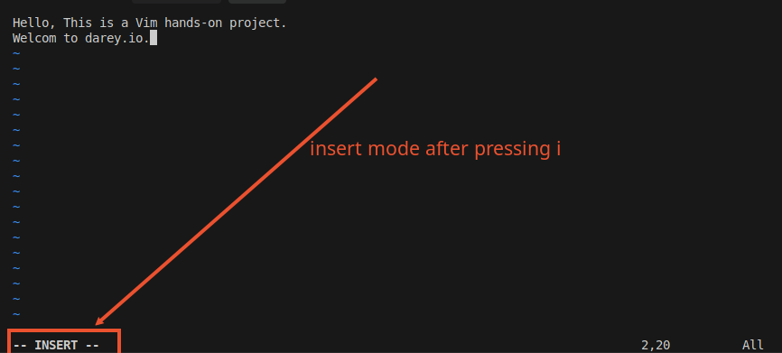

# Linux Text Editor

A Linux text editor is a software application/program specifically designed to create, modify, and manage text files on a linux-based operating system.. Text editors play a crucial role in the Linux environment, providing a means for users to interact with and manipulate plain text files, configuration files, scripts, and other text-based content or documents.

There are various text editors available in the Linux ecosystem, each with its own unique features, capabilities, and user interfaces. Some of the most popular text editors include:

1. Nano
2. Vim
3. Emacs
4. Gedit
5. Kate
6. Pluma
7. Leafpad
8. Mousepad
9. Geany
10. Sublime Text
11. Atom
12. Visual Studio Code
13. Notepad++
14. Geany

## Vim Text Editor

The Linux Vim text editor, short for "Vi Improved", is a powerful and versatile text editing tool deeply ingrained in the Unix and Linux ecosystem. Vim builds upon the foundation of the original Vi editor, ofering an extensive set of features, modes, and commands that empower users to amnipulate tect efficiently and effectively. While Vim has a steeper learning curve, compared to Nano and other text editors, its capabilities make it a favourite among tech professionals and anyone working extensively with text files.

###Working with VIM Editor

Let's explore the basic features and commands of the VIM editor.

1. **Opening a file in VIM**

```bash
vim test.txt
```

The above command creates a new `test.txt` file even if it doesn't exist. Then it opens the file up so that we can start writing into it. Its just like opening up a Notepad file on windows.


As you can see, the file is hidden only shows that the file has been created for editing when the `ls -a` command is used.

2. **Entering Insert Mode**
    - press `i` key to enter insert mode
    - Type the following text into the file:
    
    ```
    Hello, this is a Vim hands-on project
    ```
    
    

    - press `Esc` key to exit insert mode
    - press `:wq` to save and quit
    
3. **Move Around:** Navigate through the text using the arrows key or the following commands:
    - `h` - move left
    - `j` - move down
    - `k` - move up
    - `l` - move right

4. **Deleting a character:** Press `esc` on the keyboard to exit the `insert` mode. Then use the following commands to delete text:
    
    - `x` - delete a character

    
5. **Deleting a line:** Press `esc` on the keyboard to exit the `insert` mode. Then use the following commands to delete text:
    
    - `dd` - delete a line
    - `dw` - delete a word
    - `d$` - delete to the end of the line
    - `d0` - delete to the beginning of the line
    - `d` - delete a range of lines

    

6. **Deleting a word:** Press `esc` on the keyboard to exit the `insert` mode. Then use the following commands to delete text:
    - `dw` - delete a word

    

7. **Deleting a range of lines:** Press `esc` on the keyboard to exit the `insert` mode. Then use the following commands to delete text:
    - `d` - delete a range of lines

        

8. **Deleting a range of words:** Press `esc` on the keyboard to exit the `insert` mode. Then use the following commands to delete text:
    - `d` - delete a range of words

    

9. **Deleting a range of characters:** Press `esc` on the keyboard to exit the `insert` mode. Then use the following commands to delete text:
    - `d` - delete a range of characters

    

10. **Undoing a change:** Press `esc` on the keyboard to exit the `insert` mode. Then use the following commands to undo a change:
    - `u` - undo a change

    

11. **Redoing a change:** Press `esc` on the keyboard to exit the `insert` mode. Then use the following commands to redo a change:
    - `Ctrl + r` - redo a change

    

12. **Saving a file:** Press `esc` on the keyboard to exit the `insert` mode. Then use the following commands to save a file:
    - `:w` - save a file
    - `:wq` - save and quit

    

13. **Quitting a file:** Press `esc` on the keyboard to exit the `insert` mode. Then use the following commands to quit a file:
    - `:q` - quit a file

    

14. **Quitting a file without saving:** Press `esc` on the keyboard to exit the `insert` mode. Then use the following commands to quit a file without saving:
    - `:q!` - quit a file without saving

    

## Nano Text Editor
Among Linux text editors, Nano stands out as a user friendly and straightforward tool, making it an excellent choice for users who are new to the command line or those who prefer a more intuitive editing experience. Nano serves as a versatile and lightweight text editor, ideal for permorming quick edits, writing scripts, or making configurations changes directly from the command line. Its intuitive command set simplifies text manipulation and editing tasks, allowing users to navigate through files, insert or delete text, and save changes with ease. Nano's ease of use extends to its keyboard shortcuts, making it accessible even to those unfamiliar with intricate command sequences. With Nano, users can focus on the content of their text file without the distraction of a complex interface, making it a go-to choice for a wide range of users, from beginners to experienced Linux enthusiasts.

###Working with Nano Editor

1. **Install Nano Editor:** Often Nano is pre-installed on most Linux distributions. If it's not installed, you can install it using the following commands:
    ```bash
    sudo apt update
    sudo apt install nano
    ```

2. **Opening a file in Nano:** named `nano_test.txt` using the `nano` command
    ```bash
    nano nano_test.txt
    ```
    
    You'll enter the Nano editor interface that is blank

3. **Entering and Editing Text:** Type a few lines of text into the file. Nano has a simple interface 


4. **Saving a file:** Press `Ctrl + O` to save the file. Nano will promt you to press `Enter` to save the file before exiting.


5. **Quitting a file:** Press `Ctrl + X` to quit the file. Nano will promt you to press `Enter` to save the file before exiting.


6. **Opening a file in Nano:** named `nano_test.txt` using the `nano` command
    ```bash
    nano nano_test.txt
    ```
    

7. **Moving around:** Press `Ctrl + X` to quit the file. Nano will promt you to press `Enter` to save the file before exiting.


    

