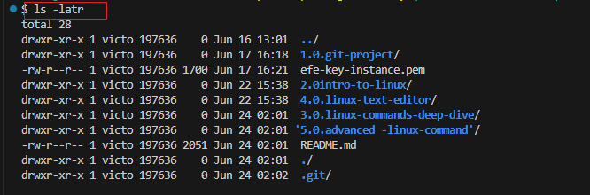
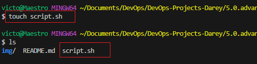
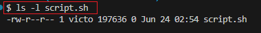

# Advanced Linux Command
## File Permissions and Ownership/Access Rights

Understanding how to manage file permissions and ownership/access rights is crucial for system security and proper file management in Linux. this knowledge empowers you to controle access to files and directories, ensuteing the security and intergrity of your system. Let's explore some essential commands and concepts related to file permissions and ownership.

In Linux, managing file permissions and ownership is vital for controlling who can access, modify, or ececute files directories. Understanding these concepts allows you to maintian the security and intergrity of your system. Let's delve into the key commands and concepts related to file permissions and ownership.

### Numeric Representation of Permissions

In Linux, file permissions are often represented using a numeric system. Each permission type **(no permission, read, write, execute)** is assigned a numeric value:

- No Permission: 0
- Read Permission: 4
- Write Permission: 2
- Execute Permission: 1

These values are combined to represent the permiossions for each user class. Let's see how this works:

### Permissions Represented by 7

- 4 (read permission) + 2 (write permission) + 1 (execute permission) = 7

    - symbolic: rwx
    - Meaning: read, write, execute permission are all granted
    - Example Context: A script file that the owner needs to read, modify, and execute.

### Permissions represented by 6

- 4 (read permission) + 2 (write permission) = 6

    - symbolic: rw-
    - Meaning: read and write permissions are granted, but execute permission is denied.
    - Example Context: A configuration file that the owner needs to read and modify, but not execute.
### Permissions represented by 5

- 4 (read permission) + 1 (execute permission) = 5

    - symbolic: r-x
    - Meaning: read and execute permissions are granted, but write permission is denied.
    - Example Context: A binary file that the owner needs to execute, but not read or modify. such as a shared library file that users can only read and execute but not modify.

## The Role of Hyphen (-) in Permission Representation

When discussing permissions, you might notice hyphens (-) in the permission representation. In the context of Linux file permissions, a hyphen doesn't actually represent a user class. Instead, it's used in the symbolic representation of permissions to show the abscence of a permission.

Lets get a bit practical with examples with running ls -latr (list all files in the current directory, including hidden files, in reverse order of modification time) command

```bash
	ls -latr
```

```bash
❯ ls -latr
total 28
drwxr-xr-x 1 victo 197636    0 Jun 16 13:01  ../
drwxr-xr-x 1 victo 197636    0 Jun 17 16:18  1.0.git-project/
-rw-r--r-- 1 victo 197636 1700 Jun 17 16:21  efe-key-instance.pem
drwxr-xr-x 1 victo 197636    0 Jun 22 15:38  2.0intro-to-linux/
drwxr-xr-x 1 victo 197636    0 Jun 22 15:38  4.0.linux-text-editor/
drwxr-xr-x 1 victo 197636    0 Jun 24 02:01  3.0.linux-commands-deep-dive/
-rw-r--r-- 1 victo 197636 2051 Jun 24 02:01  README.md
drwxr-xr-x 1 victo 197636    0 Jun 24 02:01  ./
drwxr-xr-x 1 victo 197636    0 Jun 24 02:02  .git/
drwxr-xr-x 1 victo 197636    0 Jun 24 02:47 '5.0.advanced -linux-command'/
```



Let's break down the output:

- In the output above, you  will notice that some of the first characterr can be a **-** or **d** or **l**. 

    - **-** : represents a regular file
    - **d** : represents a directory
    - **l** : represents a link

- The next three characters (rwx) represent the permissions for the owner of the file.

    - **r** : read permission (4)
    - **w** : write permission (2)
    - **x** : execute permission (1)

    - **rwx** : read, write, and execute permissions are granted (4 + 2 + 1 = 7)
    - **rw-** : read and write permissions are granted, but execute permission is denied (4 + 2 = 6)
    - **r-x** : read and execute permissions are granted, but write permission is denied (4 + 1 = 5)
    - **r--** : read permission is granted, but write and execute permissions are denied (4)
    - **-wx** : write and execute permissions are granted, but read permission is denied (2 + 1 = 3)
    - **-w-** : write permission is granted, but read and execute permissions are denied (2)
    - **--x** : execute permission is granted, but read and write permissions are denied (1)
    - **---** : no permissions are granted (0)

- The hyphen (-) in the permission representation is used to show the abscence of a permission. It is used to show that a permission is not granted.

- The first three characters (rwx) represent the permissions for the **owner** of the file. the next three characters (rwx) represent the permissions for the **group** of the file. the last three characters (rwx) represent the permissions for the **others** of the file.

The order the user class is representred is as follows:

- the first hyphen (-) represents the permissions for the owner of the file.
- the second hyphen (-) represents the permissions for the group of the file.
- the third hyphen (-) represents the permissions for the others of the file.

example:
```bash
-rw-r--r-- 1 victo 197636 1700 Jun 17 16:21  efe-key-instance.pem
```

from the above example, we can see that the owner has read, write, and execute permissions, the group has read and execute permissions, and the others have read and execute permissions.

## File Permissions Commands

To manage file permissions and owners. Linux provides several commands:

### chmod (change mode) command

The `chmod` command is used to change the permissions of a file or directory. You can use both **symbolic** and **numeric** representation to change the permissions to the user, group, and others.

Let's see an example

Create an empty file using the `touch` command
```bash

touch script.sh
```



Check the permissions of the file using the `ls -l` command
```bash
 ls -l script.sh
-rw-r--r-- 1 victo 197636 0 Jun 24 02:54 script.sh
```



**What the permission of the above output represent:**
- **-rw-r--r--** : the file is a regular file, the owner has read and write permissions, the group has read permissions, and the others have read permissions.
    - **-** : the file is a regular file
    - **rw-** : the owner has read and write permissions (6)
    - **r--** : the group has read permissions (4)
    - **r--** : the others have read permissions (4)

Note: The permissions are combined to represent the permissions for each user class. 

Now let's change the permissions of the file using the `chmod` command

```bash
chmod +x script.sh
```


The above command uses the `chmod` command with the `+x` option to add execute permissions to the file `script.sh`. The `+x` option adds execute permissions to the already existing permissions of the file for all the user classes (owner, group, and others).


