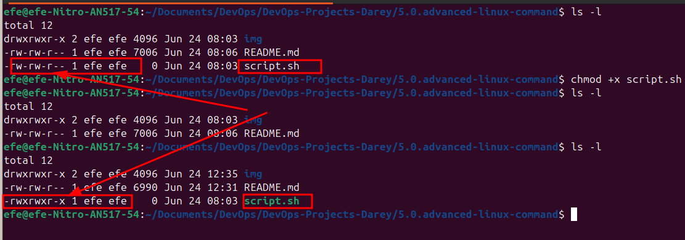
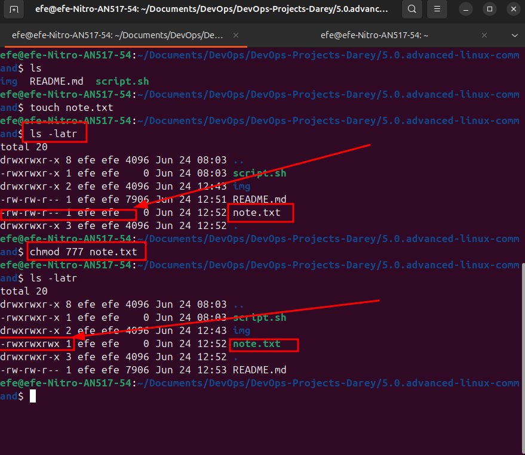
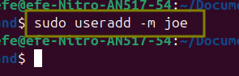
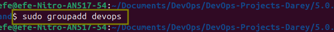

# Advanced Linux Command
## File Permissions and Ownership/Access Rights

Understanding how to manage file permissions and ownership/access rights is crucial for system security and proper file management in Linux. this knowledge empowers you to controle access to files and directories, ensuteing the security and intergrity of your system. Let's explore some essential commands and concepts related to file permissions and ownership.

In Linux, managing file permissions and ownership is vital for controlling who can access, modify, or ececute files directories. Understanding these concepts allows you to maintian the security and intergrity of your system. Let's delve into the key commands and concepts related to file permissions and ownership.

### Numeric Representation of Permissions

In Linux, file permissions are often represented using a numeric system. Each permission type **(no permission, read, write, execute)** is assigned a numeric value:

- No Permission: 0
- Read Permission: 4
- Write Permission: 2
- Execute Permission: 1

These values are combined to represent the permiossions for each user class. Let's see how this works:

### Permissions Represented by 7

- 4 (read permission) + 2 (write permission) + 1 (execute permission) = 7

    - symbolic: rwx
    - Meaning: read, write, execute permission are all granted
    - Example Context: A script file that the owner needs to read, modify, and execute.

### Permissions represented by 6

- 4 (read permission) + 2 (write permission) = 6

    - symbolic: rw-
    - Meaning: read and write permissions are granted, but execute permission is denied.
    - Example Context: A configuration file that the owner needs to read and modify, but not execute.
### Permissions represented by 5

- 4 (read permission) + 1 (execute permission) = 5

    - symbolic: r-x
    - Meaning: read and execute permissions are granted, but write permission is denied.
    - Example Context: A binary file that the owner needs to execute, but not read or modify. such as a shared library file that users can only read and execute but not modify.

## The Role of Hyphen (-) in Permission Representation

When discussing permissions, you might notice hyphens (-) in the permission representation. In the context of Linux file permissions, a hyphen doesn't actually represent a user class. Instead, it's used in the symbolic representation of permissions to show the abscence of a permission.

Lets get a bit practical with examples with running ls -latr (list all files in the current directory, including hidden files, in reverse order of modification time) command

```bash
	ls -latr
```

```bash
❯ ls -latr
total 28
drwxr-xr-x 1 victo 197636    0 Jun 16 13:01  ../
drwxr-xr-x 1 victo 197636    0 Jun 17 16:18  1.0.git-project/
-rw-r--r-- 1 victo 197636 1700 Jun 17 16:21  efe-key-instance.pem
drwxr-xr-x 1 victo 197636    0 Jun 22 15:38  2.0intro-to-linux/
drwxr-xr-x 1 victo 197636    0 Jun 22 15:38  4.0.linux-text-editor/
drwxr-xr-x 1 victo 197636    0 Jun 24 02:01  3.0.linux-commands-deep-dive/
-rw-r--r-- 1 victo 197636 2051 Jun 24 02:01  README.md
drwxr-xr-x 1 victo 197636    0 Jun 24 02:01  ./
drwxr-xr-x 1 victo 197636    0 Jun 24 02:02  .git/
drwxr-xr-x 1 victo 197636    0 Jun 24 02:47 '5.0.advanced -linux-command'/
```


Let's break down the output:

- In the output above, you  will notice that some of the first characterr can be a **-** or **d** or **l**. 

    - **-** : represents a regular file
    - **d** : represents a directory
    - **l** : represents a link

- The next three characters (rwx) represent the permissions for the owner of the file.

    - **r** : read permission (4)
    - **w** : write permission (2)
    - **x** : execute permission (1)

    - **rwx** : read, write, and execute permissions are granted (4 + 2 + 1 = 7)
    - **rw-** : read and write permissions are granted, but execute permission is denied (4 + 2 = 6)
    - **r-x** : read and execute permissions are granted, but write permission is denied (4 + 1 = 5)
    - **r--** : read permission is granted, but write and execute permissions are denied (4)
    - **-wx** : write and execute permissions are granted, but read permission is denied (2 + 1 = 3)
    - **-w-** : write permission is granted, but read and execute permissions are denied (2)
    - **--x** : execute permission is granted, but read and write permissions are denied (1)
    - **---** : no permissions are granted (0)

- The hyphen (-) in the permission representation is used to show the abscence of a permission. It is used to show that a permission is not granted.

- The first three characters (rwx) represent the permissions for the **owner** of the file. the next three characters (rwx) represent the permissions for the **group** of the file. the last three characters (rwx) represent the permissions for the **others** of the file.

The order the user class is representred is as follows:

- the first hyphen (-) represents the permissions for the owner of the file.
- the second hyphen (-) represents the permissions for the group of the file.
- the third hyphen (-) represents the permissions for the others of the file.

example:
```bash
-rw-r--r-- 1 efe efe 0 Jun 24 02:54 script.sh
```

from the above example, we can see that the owner has read, write, and execute permissions, the group has read and execute permissions, and the others have read and execute permissions.

## File Permissions Commands

To manage file permissions and owners. Linux provides several commands:

### chmod (change mode) command

The `chmod` command is used to change the permissions of a file or directory. You can use both **symbolic** and **numeric** representation to change the permissions to the user, group, and others.

Let's see an example

Create an empty file using the `touch` command
```bash

touch script.sh
```


Check the permissions of the file using the `ls -l` command
```bash
 ls -l script.sh
-rw-r--r-- 1 efe efe 0 Jun 24 02:54 script.sh
```


**What the permission of the above output represent:**
- **-rw-r--r--** : the file is a regular file, the owner has read and write permissions, the group has read permissions, and the others have read permissions.
    - **-** : the file is a regular file
    - **rw-** : the owner has read and write permissions (6)
    - **r--** : the group has read permissions (4)
    - **r--** : the others have read permissions (4)

Note: The permissions are combined to represent the permissions for each user class. 

Now let's change the permissions of the file using the `chmod` command

```bash
chmod +x script.sh
```


The above command uses the `chmod` command with the `+x` option to add execute permissions to the file `script.sh`. The `+x` option adds execute permissions to the already existing permissions of the file for all the user classes (owner, group, and others).

Now let's check what the permissions of the file are using the `ls -l` command the permission look like:

```bash
ls -l script.sh
-rwxrwxr-x 1 efe efe    0 Jun 24 08:03 script.sh

```



The same command can be executed to achieve the same result using the number apprach

```bash
chmod 755 script.sh
```
To add execute permission to for all (user, group, and others), we just add 1 to each of the three user classes (owner, group, and others), resulting in 755.

- 7 : 4 (read) + 2 (write) + 1 (execute)
- 5 : 4 (read) + 1 (execute)
- 5 : 4 (read) + 1 (execute)

To demonstrate it, let's create a new file using the  `note.txt`
```bash
touch note.txt
```

To allow group members and others to read, write, and execute the file, change it to the -rwxrwxrwx type using the `chmod` command
```bash
chmod 777 note.txt
```

Check tje output of the `ls -latr` command
```bash
ls -latr
-rwxrwxrwx 1 efe efe    0 Jun 24 12:52 note.txt
```



Now Nootice the dash (-) in the first position represents the file type and noite a user class. It indicates that the entry is a regular file.

**Changing mode for just user:**

```bash
chmod u+rw note.txt
```


**Changing mode for just group:**

```bash
chmod g+x note.txt
```

      

**Changing mode for just others:**

```bash
chmod o+r-x note.txt
```


### chown (change owner) command

The `chown` command is used to change the owner of a file or directory or symbolic link to a spedified username or group name.

Here is the basic syntax of the `chown` command:

```bash
chown [options] [owner][:[group]] file
```

where

- options : optional parameters that modify the behavior of the command
- owner : the username of the new owner of the file
- group : the group name of the new group of the file
- file : the file to be changed

**Example:**

Lets assume there is a user on the server called `john`, a group on the server called `developers` and we want the owner of note.txt to be `john` and the group to be `developer`.

The command would look like below:

```bash
chown john:developer note.txt
```


## Superuser Privileges

It is often neccessary to become the superuser to perform important tasks in linux, nut as we know, we should not stay logged in as superuser. In most linux distributions, there is a command that can give you temporary access to the superuser's privileges. This program is called sudo (short for superuser do) and can be used in those cases when you need to be the superuser for a small number of tasks. To use the superuser privileges, simply type `sudo` before the command you want to run as superuser. 

**Example:**

```bash
sudo apt update
```


To switch to the root user, simply run 
```bash
sudo -i
```


you can type `exit` to exit the root user.


## User Management on Linux

As a DevOps engineer, you are also going to be doing a system administration which involves managing differenet users on the server. You should know how to create a new user, or group, modify thier permissions, update passwords and such similar tasks.

### Create User (useradd)

To create a new user, you can use the `useradd` command. Assuming the name of the user to be `joe`. rund the command below:

```bash
sudo useradd joe
```



Running this command will prot you to enter some additional information about the user, such as their full name, and contact informtion. Once provided, the user account will be created and a home directory will be automatically created for the user


To check if the user has been created, run the command below:

```bash
sudo useradd joe
```


The home directory for the user `joe` will be created in the `/home` directory and is seen as `/home/joe`. The home directory is a directory that contains the user's personal files and settings. 


### Grant Administartive Privileges (usermod)

By default, newly created user accounts do not have administrative privileges. To grant administrative access to a user, you can add the user to the `sudo` group. Users in the sudo group can run commands with administrative privileges using the `sudo` command. To add joe to the sudo group, run the command below:

```bash
sudo usermod -aG sudo joe
```


- `-aG` : append the user to the group. It is the flag used to add the user to the group
    - `-a` : stands for append and is used to add the user to the specidfic group(s) without removing them from other group they may already belong to.
    - `-G` : stands for supplementary group and is followed by comma separated list of groups to which the user will be added.
- `sudo` : the group to which the user will be added

- In the above command, `-aG sudo` is used to add the user `joe` to the sudo group. 

- The sudo group is typically associated with administrative or superuser privileges. . By adding `joe` to the sudo group,  `joe` will gain the ability to execute commands with the group privileges. 

**Tasks:**

- Log out and log back as the newly created user

- Navigate to the `/home/joe` directory and list the contents of the directory.

### Remove User (userdel)

To remove a user, you can use the `userdel` command. Assuming the name of the user to be `joe`. rund the command below:

```bash
sudo userdel joe
```


### Switch User (su)

To switch to a different user, you can use the `su` command. Assuming the name of the user to be `joe`. rund the command below:

```bash
su joe
```


### Modify User (usermod)

**Change User Password**

To change the password of a user, you can use the `passwd` command. Assuming the name of the user to be `joe`. rund the command below:

```bash
sudo passwd joe
```


You will be pormted to enter and confirm the new password for the user.

**Tasks:**

- Change the password of the user `joe` to `password123`
- Test the updated password by logging on to the server, using the newly updated password.

### Delete User (userdel)

To delete a user, you can use the `userdel` command. Assuming the name of the user to be `joe`. rund the command below:

```bash
sudo userdel joe
```


### Createing Group (groupadd)

To create a new group, you can use the `groupadd` command. Assuming the name of the group to be `developers`. rund the command below:

```bash
sudo groupadd developers
```



**Adding Users to the Group (usermod)**

To add a user to a group, you can use the `usermod` command. Assuming the name of the user to be `joe` and the group to be `developers`. rund the command below:

```bash
sudo usermod -aG developers joe
```


- The `-aG` option is used to add the user to the group without removing them from other group they may already belong to.

**Verifying Group Membership (id)**

To verify the group membership of a user, you can use the `id` command. Assuming the name of the user to be `joe`. rund the command below:

```bash
id joe
```


This command displays informtaion about the user `joe`, including the groups they belong to, such as developers.

### Remove Group (groupdel)

To remove a group, you can use the `groupdel` command. Assuming the name of the group to be `developers`. rund the command below:

```bash
sudo groupdel developers
```


### Ensuring proper Group Permissions

Group in Linux are oftern used to manage permissions for file and directories. Ensure that the relevant files or directories have the appropriate group ownership and permissions. For example, to grant the developers group read and write permissions to a directory, you can use the `chown` command.

```bash
sudo chown :developers /path/to/directory
```


And to grant read and write permissions to the group, run the command below:

```bash
sudo chmod g+rw /path/to/directory
```


## Assignment

- Create a group on the server called `devops`
- Create 5 users `["mary", "mohamed", "ravi", "tunji", "sofia"]`, and ensure each user belong to the devops group
- Crreate a folder for each user in the `/home` directory, for example `/home/mary`, `/home/mohamed`, `/home/ravi`, `/home/tunji`, `/home/sofia`
Ensure that the group ownership of each creatred folder belons to Devops

## Solution

```bash
sudo groupadd devops
sudo useradd -m -g devops mary
sudo useradd -m -g devops mohamed
sudo useradd -m -g devops ravi
sudo useradd -m -g devops tunji
sudo useradd -m -g devops sofia
sudo mkdir /home/mary
sudo mkdir /home/mohamed
sudo mkdir /home/ravi
sudo mkdir /home/tunji
sudo mkdir /home/sofia
sudo chown :devops /home/mary
sudo chown :devops /home/mohamed
sudo chown :devops /home/ravi
sudo chown :devops /home/tunji
sudo chown :devops /home/sofia
```