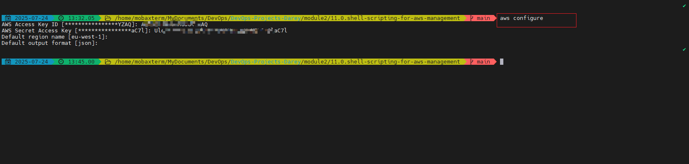

#  Shell Script for AWS IAM Management

## Project Scenario

CloudOps Solutions is a growing company that recently adopted AWS to manage its cloud infrastructure. As the company scales, they have decided to automate the process of managing AWS Identity and Access Management (IAM) resources. This includes the creation of users, user groups, and the assignment of permissions for new hires, especially for their DevOps team.

## Purpose

You will extend your shell script capabilities by creating more functions inside the "aws-iam-manager.sh" script to fulfill the objectives below. Ensure that you have already configured AWS CLI in your terminal and the configured AWS Account have the appropriate permissions to manage IAM resources.

## Objectives:
- Extend the provided script to include IAM management by:  Defining IAM User Names Array to store the names of the five IAM users in an array for easy iteration during user creation.  

- Create the IAM users as you iterate through the array using AWS CLI commands.  

- Define and call function to create an IAM group named "admin" using the AWS CLI commands.  

- Attach AWS managed administrative policy e.g. "AdministratorAccess" to the "admin" group to grant administrative privileges.  

- Iterate through the array of IAM usernames and assign each user to the "admin" group using AWS CLI commands.

## Pre-requisite

- Ensure that you have already configured AWS CLI in your terminal and the configured AWS Account have the appropriate permissions to manage IAM resources.
- COmpletion of the Linux foundation Shell Scripting mini projects

Submit the following deliverables:

1. Comprehensive Documentation detailing your entire proccess in developing the script

2. [Link to the extended script](aw-iam-manager.sh)


## Solution

Below is the entire thought process and the scipt to the external script along with some images to show the script at work

### Step 1: Write the script using the format below. 
see [aws-iam-manager.sh](aw-iam-manager.sh) script for full shell script.

```bash
#!/bin/bash

# AWS IAM Manager Script for CloudOps Solutions
# This script automates the creation of IAM users, groups, and permissions

# Define IAM User Names Array
IAM_USER_NAMES=()

# Function to create IAM users
create_iam_users() {"\n    echo \"Starting IAM user creation process...\"\n    echo \"-------------------------------------\"\n    \n    echo \"---Write the loop to create the IAM users here---\"\n    \n    echo \"------------------------------------\"\n    echo \"IAM user creation process completed.\"\n    echo \"\"\n"}

# Function to create admin group and attach policy
create_admin_group() {"\n    echo \"Creating admin group and attaching policy...\"\n    echo \"--------------------------------------------\"\n    \n    # Check if group already exists\n    aws iam get-group --group-name \"admin\" >/dev/null 2>&1\n    echo \"---Write this part to create the admin group---\"\n    \n    # Attach AdministratorAccess policy\n    echo \"Attaching AdministratorAccess policy...\"\n    echo \"---Write the AWS CLI command to attach the policy here---\"\n        \n    if [ $? -eq 0 ]; then\n        echo \"Success: AdministratorAccess policy attached\"\n    else\n        echo \"Error: Failed to attach AdministratorAccess policy\"\n    fi\n    \n    echo \"----------------------------------\"\n    echo \"\"\n"}

# Function to add users to admin group
add_users_to_admin_group() {"\n    echo \"Adding users to admin group...\"\n    echo \"------------------------------\"\n    \n    echo \"---Write the loop to handle users addition to the admin group here---\"\n    \n    echo \"----------------------------------------\"\n    echo \"User group assignment process completed.\"\n    echo \"\"\n"}

# Main execution function
main() {"\n    echo \"==================================\"\n    echo \" AWS IAM Management Script\"\n    echo \"==================================\"\n    echo \"\"\n    \n    # Verify AWS CLI is installed and configured\n    if ! command -v aws &> /dev/null; then\n        echo \"Error: AWS CLI is not installed. Please install and configure it first.\"\n        exit 1\n    fi\n    \n    # Execute the functions\n    create_iam_users\n    create_admin_group\n    add_users_to_admin_group\n    \n    echo \"==================================\"\n    echo \" AWS IAM Management Completed\"\n    echo \"==================================\"\n"}

# Execute main function
main

exit 0
```
### Step 2: confirm that awscli is installed using;

```bash
aws --version
```


### step 3: ssh into aws with an aws iam user credentials using

```bash
aws configure
```



**Step 3: Rund scrip to ensure all are working well**

