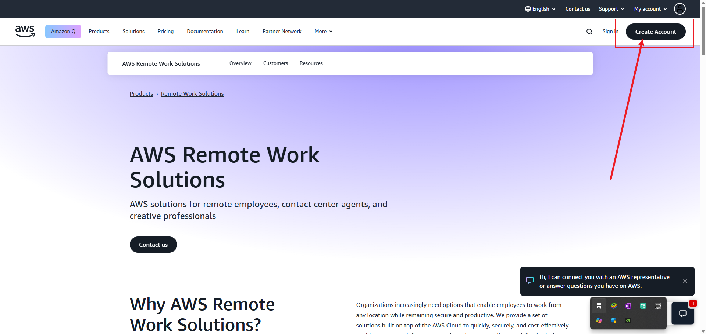

# AWS Account Creation Projecct

This mini project designed to walk you trhough the process of creating an Amazon Web Services (AWS) account, providing step-by-step guidance and insights into the intricacies of setting up your AWS account. Before delving into the specifics of account creation, it's important to understand the fundamental principles of cloud computing, which serve as the foundation of this project. If you're new to the concept of "Cloud", it's recommended to familiarize yourself with cloud computing basics to fully grasp the significance of AWS account creation.

**Project Goals and Learning Outcomes:**

- Understanding the basics of AWS Cloud and its importance for business and individuals.

- Successfully create an AWS account and navigate through the setup process

- Learn how to access the AWS Management Console using newly created credentials and navigate through the different services and features.

- Gain practical experience using AWS services effectively for furture projects or business needs.

## What is Cloud?

You can imagin your computer or phone. It stores all your pictures, files, and apps, right? But what if you run our od space or loss your devices? That's where the cloud comes in . The cloud is like a giant digital storage space, but it's not just computers connected over the internet. These computers store and manage all your stuff securely.

It's like having a magical backpack that holds all your stuff, and you can access it whenever you need, no matter where you are.

SO instead of keeping everything on your device, you can store it in the cloud and access it from anywhere so long as you have an internet connection.

## What is AWS Cloud?

There are many cloud providers like Azure, Google Cloud, and IBM Cloud, each offering a range of services for business and individuals. Amazon Web Services (AWS) is one of the largest and most trusted cloud providers, offering a wide range of services including compute, storage, databases, analytics, machine learning, and more.

It offers a vast arrays of computing resources, including servers, storage, database, networking, and more, all delivered over the internet. It's like a huge digital warehouse where you can store and process data, and access it from anywhere in the world.

**Note**: A cloud provider is a company that offers online storage and computing services. They let you store your data and run your apps on thier powerful computers, which you can access over the internet.

## Importance of AWS Cloud?

The 
aws 
cloud is important because it let's business and individuals do things that were once only possible for big companies with lots of money. Now, even small businesses and startups can access the same powerful tools and technology to build, grow, and scale thier ideas.

Example - If you are stareting a new business, and you need a computer, sone memory (RAM), storage space (like a hard disk), and a fast processor (CPU) to run your new app. But here's the tricky part: you're not sure if your business will take off, if lots of people will use your app, or if it'll just be a small project.

Instead of buysin all those resources upfront, which could cost a ton of money, you can think of AWS lik a big rental store for digital stuffs. You only take what you need right awa, and you pay for it as you go.  So if your app suddenly gets really popular and needs more resources, you can easily get them from AWS without breaking bank. And if things slow down, you can scale back and pay less. 

**Note**: In the "pay as you go" model of AWS, you are charged for the services you use, like storing data or tunning a website. If you use more, you pay more. If you use less, you pay less. This way, you only pay for what you actually use, make it flexible and cost-effecticre for businesses of all sizes.

## Setting up AWS Account

From previous project, aws registeration has been done. See [README.md](../1.0.tech-env-setup/README.md) for more information.

- **Visit the AWS website:** Go to [AWS](https://aws.amazon.com) and create an account

- **Create an account:** Go to [AWS](https://aws.amazon.com) and create an account

- **Enter your credentials:** Enter your credentials to create an account

- **Verify your account:** Verify your account by checking your email for a verification email

- **Complete the Captcha:** Complete the Captcha to verify that you are not a robot

- **Choose a plan:** Choose a plan that suits your needs. AWS offers a free plan which is more than enough for this course. You will be required to supply your card details for verification purposes. 

-**Tailor your experinces (Optional):** Tailor your experinces (Optional) by selecting the features that you want to use

- **Welcome to AWS:** Once you've completed the above steps, you should be redirected to your new AWS account.

- **Explore AWS:** Take some time to explore teh AWS platform. Familiarize yourself with the different features of the platform and how to use them.

On this project, a step guid will be given without further images.

1. Open the create AWS account page at https://aws.amazon.com/create-account/

2. Click on [Create an AWS Account](https://aws.amazon.com/create-account/)

3. Fill in the required information:

- Full name
- Phone number
- Email address
- Password

4. Click on "Create Account"

5. Verify your email address

6. Paste the code from your email into the box below

7. Click on "Verify"

8. Your Email is verified
 a) Now set Root User Password
 b) Then Click on Continue.

9. Now, the registeration process will ask your Personal Information. Enter all the required information.

10. As per your request, please provide your payment informtion for verification purposes. 

a. Reset assured, they will not charge you unless your usage surpasses the [AWS Free Tier limits](https://aws.amazon.com/free/).

Kindly  note that some credit card or debit card companies may authorixe a nominal charge of approximately USD $1.00 to validate the card's authenticicty, with the charge typically being reversed shortly thereafter.

b. Click on verify and continue.

Your payment process will be initiated. Please rest assured that your payment information will be securely processed.

## Assessing the AWS cloud account

After completing the registeration process, you can access the AWS Management Console using your new AWS account credentials. 

- Now, Enter you pesonalize information and click on continue.

- You have the option of choosing to sign in as a Root user or a IAM user. 

- Click on "Sign In to the Console" to access the AWS Management Console.

- You would have successfully signed in and up for your aws account. Bear in mind that these has been done several times in previous projects.

**Project Reflections:**

- Understand AWS CLound: AWS Cloud provides a virtual space for storing digital cantnents, making it easier to manage photo, videos, documents, and even create new apps or websites.

- Importance of AWS cloud: Cloud levels the playing ground for businesses, allowing even small startups to access powerful computing tools without huge upfront costs. It also provides flexibility and scalability, enabling businesses to easily adjust their resources based on their needs. It's like renting a warehouse for your business.

- Setting up AWS account: The project walks throus some step process of creating AWS account. not giving exat steps as it has been done in previous projects.

- Accessing AWS management Console: Once the account was set up successfully, users gain support plan was chosen and the account was created. The user is then redirected to the AWS Management Console. 

